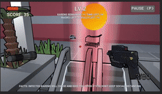

# Toilet Pandemia

**To-Do List**

- [ ] Brief explanation of the game
- [ ] How to use it (especially the user interface aspects)
- [ ] How you modelled objects and entities
- [ ] How you handled the graphics pipeline and camera motion
- [ ] Descriptions of how the shaders work
- [ ] Description of the querying and observational methods used, including: description of the participants (how many, demographics), description of the methodology (which techniques did you use, what did you have participants do, how did you record the data), and feedback gathered.
- [ ] Document the changes made to your game based on the information collected during the evaluation.
- [ ] A statement about any code/APIs you have sourced/used from the internet that is not your own.
- [ ] A description of the contributions made by each member of the group.


## Table of contents
<details>
<summary> Click to expand
</summary>

- [Toilet Pandemia](#toilet-pandemia)
  - [Table of contents](#table-of-contents)
  - [Team Members](#team-members)
  - [Game Explanation and Gameplay](#game-explanation-and-gameplay)
    - [**Game Explanation**](#game-explanation)
    - [**Gameplay**](#gameplay)
      - [**<u>Controls</u>**](#ucontrolsu)
      - [**<u>User Interface</u>**](#uuser-interfaceu)
      - [***Menu***](#menu)
      - [***Game Over***](#game-over)
      - [***Gameplay***](#gameplay-1)
  - [Modelling Objects and Entities](#modelling-objects-and-entities)
    - [Object Pooling](#object-pooling)
    - [Karen Control](#karen-control)
      - [**Following Player**](#following-player)
      - [**Close-Range Infection**](#close-range-infection)
      - [**Shooting Fireballs**](#shooting-fireballs)
    - [Level Switching & Vaccine](#level-switching--vaccine)
  - [Graphics and Camera](#graphics-and-camera)
  - [Shaders and Particles](#shaders-and-particles)
    - [Toon Shader](#toon-shader)
      - [1. Multiple light sources:](#1-multiple-light-sources)
      - [2. Ambient Light:](#2-ambient-light)
      - [3. Specular refecltion](#3-specular-refecltion)
      - [4. Rim lighting](#4-rim-lighting)
    - [Outline Shader](#outline-shader)
    - [Half-tone Shader](#half-tone-shader)
    - [Transparency Modification Shaders](#transparency-modification-shaders)
    - [Particles](#particles)
      - [Explosion](#explosion)
      - [Additive Blending](#additive-blending)
  - [Evaluation Techniques](#evaluation-techniques)
  - [External Code/APIs](#external-codeapis)
  - [Team Contributions](#team-contributions)

</details>

## Team Members

|       Name        |
| :---------------: |
|   Angus Hudson    |
|    Khoi Nguyen    |
| Luu Hoang Anh Huy |
|    Hoang Long     |

## Game Explanation and Gameplay
### **Game Explanation**

Our game is a first person shooter (FPS), based in a post-apocalyptic world where COVID-19 has ravaged the world's population. You assume the role of an average manager, intent on locating and distributing the vaccine to finally put an end to the pandemic. However this vaccine is held in a nearby shopping center, defended by a horde of Karens who want nothing more than to see the world burn, having succumbed to the frustrations of state-enforced lockdown long ago. 

Your objective, to enter the shopping center, and collect critical supplies for the residents in your community, all the while doing the following:

1. Avoiding incineration at the hands of the Karens' powerful fire attacks
2. Maintaining an appropriate 1.5m social distance, or else risk contracting COVID-19 from the Karens themselves
3. Surviving long enough to discover the super vaccine, and taking it when it appears

Points are accrued for gathering supplies, defeating Karens, and surviving levels. Health packs will also randomly spawn, that will allow the player to recover any lost health. The game takes on a classic arcade 'survival' format, that is, the player plays until he/she finally falls to the Karen hordes, an inevitability since each level rises in difficulty to eventually impossible scenarios.

### **Gameplay**

#### **<u>Controls</u>**
|    Button    |      Function      |
| :----------: | :----------------: |
|  `W/A/S/D`   | Character Movement |
|   `Space`    |        Jump        |
| `Left-Mouse` |       Shoot        |

#### **<u>User Interface</u>**

#### ***Menu***
<p align="center">
  
  <br>Main menu.
</p>

#### ***Game Over***
<p align="center">
  
  <br>Game over.
</p>

#### ***Gameplay***

*Health Bar*

*Scoring System*

*Level Count*

*Hints*

[Insert UI screenshot with captions explaining the different features on-screen]

## Modelling Objects and Entities

### Object Pooling

In order to maintain efficiency for CPU and avoid continuous calls of `Instanstiate()` and `Destroy()`, an object pool is created in order to keep game objects reusable. The common mechanisim goes as follows (based on [pooling tutorial by Mark Placzek](https://www.raywenderlich.com/847-object-pooling-in-unity)):

* A pool of chosen data structure (in this project: `List`) type is created to store objects of a specified number.
```C#
// How a pooled object's information are stored - ObjectPool.cs
[System.Serializable] public class ObjectPoolItem {
    public string name;                 // Object name
    public GameObject objectToPool;     // Prefab of object
    public float amountToPoolEachLevel; // How many to expand each level
    public bool shouldExpand;           // Indicates no limit in capacity
}

public List<ObjectPoolItem> itemsToPool;    // Information storage
public List<GameObject> pooledObjects;      // Object pool data structure
```

```C#
// How a pool is initiated - ObjectPool.cs

pooledObjects = new List<GameObject>();
foreach (ObjectPoolItem item in itemsToPool) {
    // Initialize the number of items required for the current level
    for (int i = 0; i < Mathf.FloorToInt(item.amountToPoolEachLevel * Player.SharedInstance.level); i++) {
        
        GameObject obj = (GameObject)Instantiate(item.objectToPool);

        // Only hide fireball, the rest appears with new level
        if (item.objectToPool.tag == "Fireball") obj.SetActive(false);
        else obj.SetActive(true);
        
        // Add to storage pool as well
        pooledObjects.Add(obj);
    }
}
```

* Every time in need, instead of calling `Instanstiate`, system will choose an inactive item in the pool data structure and activate it.
```C#
// How objects are retrieved on new level rather than Instanstiating - Player.cs 
void SpawnNewLevel() {

    // Look through each pool of item
    foreach (ObjectPoolItem item in ObjectPooler.SharedInstance.itemsToPool) {
        string tag = item.objectToPool.tag;

        // Fireball is only stored for boss karens only, not with levels
        if (tag == "Fireball") continue;

        // Pick items with needed quantity (by level), and set to be active in map
        for (int i = 0; i < Mathf.FloorToInt(item.amountToPoolEachLevel * level); i++) {
            GameObject obj = ObjectPooler.SharedInstance.GetPooledObject(tag);
            if (obj != null) {
                // Allocate a spawn position, and spawn object from there
                obj.GetComponent<randomSpawn>().SetPosition();
                obj.SetActive(true);
            }
        }
    }
}
```

* In case of no available object in the pool left, system can either stop if there is a capacity limit, or `Instanstiate` another available object to put to list and later used in the future.
```C#
// How an object is retrieved from the pool - ObjectPool.cs

// Returns an object from the pool to be activated
public GameObject GetPooledObject(string tag) {
    // Search in the pool to see if there is any available object left
    for (int i = 0; i < pooledObjects.Count; i++) {
        if (!pooledObjects[i].activeInHierarchy && pooledObjects[i].tag == tag) 
        return pooledObjects[i];
    }

    // If there is none available left, just make a new one
    foreach (ObjectPoolItem item in itemsToPool) {
        if (item.objectToPool.tag == tag) {
            // Note: If there is limited capacity requirement, 
            // then skip this process and return null
            if (item.shouldExpand) {
                GameObject obj = (GameObject)Instantiate(item.objectToPool);
                obj.SetActive(true);
                pooledObjects.Add(obj);
                return obj;
            }
        }
    }
    return null;
}
```
* When ending functionality, rather than `Destroy`, system will deactivate the object ( `GameObject.SetActive(false)` ) and put it back to the data structure for later usage.

Currently in the game, the object pool is being used on the following objects that will require the most amount of `Instanstiate` if not using pool:
* Karens
* Bonus items
* Fireball shot by Karens

<p align="center">
  
  <br>Pooled objects are only created once on game start, and only change active status afterwards.
</p>

### Karen Control

As the main enemy, Karens in the game has the objective to chase and infect the player.

#### **Following Player**
When the player is detected to be in sight, depending on the type of Karen, it will either follow, or aim at player
```C#
// Check if player and karen are close to each other on the same elevation - EnemyFollowing.cs

float d // Euclidean distance
= Vector3.Distance(followingPlayer.transform.position, transform.position); 

float deltaHeight // Height difference, to avoid detection between different floors
= Mathf.Abs(transform.position.y-followingPlayer.transform.position.y); 

// If in sight...
if (d < distance && deltaHeight < minimumHeightDifference) {
    // Follow or aim at player
    transform.LookAt(followingPlayer.transform.position);
    ...
}
```
<p align="center">
  
  <br>A Karen detected and then chased the player.
</p>

#### **Close-Range Infection**
Of course, if the player do not keep social distancing, then health will decrease by time.
```C#
// Called every update to see if social distancing is maintained. If not, drain health - Player.cs
void Distance()
{
    // Check each enemy...
    for (int i = 0; i < targets.Length; i++){
            // ... to see how far they are from player
        float distance = Vector3.Distance(targets[i].transform.position, transform.position);
            // If social distancing is broken, then reduce health
        if (distance < distanceMinimum)
        {
            ... // Decrease health
        }
    }

}
```
<p align="center">
  
  <br>A Karen that infects the player on close range.
</p>

#### **Shooting Fireballs**

If a Karen is capable of shooting fireballs, it will do so when player is in sight.
```C#
// Shooting fireballs on sight - BossBehavior.cs

// If in sight...
if (d < distance && deltaHeight < 5) {
    CheckIfTimeToFire();    // Shoot fireballs
}
```

As mentioned, at a constant rate, fireballs will be taken from the object pool rather than being instanstiated. It will either explodes on collision with player, or vanish after a while in the air.
```C#
// Shoot fireball after a specified period of time - BossBehavior.cs
public void CheckIfTimeToFire()
{
    // When specified shooting time is reached
    if(Time.time > nextFire)
    {
        // Initiate a fireball from pool
        GameObject obj = ObjectPooler.SharedInstance.GetPooledObject("Fireball");
        if (obj != null) {
            obj.transform.position = transform.position;
            obj.transform.rotation = Quaternion.identity;
            obj.SetActive(true);

            // Set fireball to aim at player
            FireBallBehavior fb = obj.GetComponent<FireBallBehavior>();
            fb.Initiate();
        }

        nextFire = Time.time + fireRate; // Set timer for the next fire
    }
} 

// How a fireball can disappear - FireBallBehavior.cs
void Update () {
    // Fireball has limited lifetime
    if (Time.time - startTime > existTime) gameObject.SetActive(false);
}
void OnTriggerEnter(Collider other) {
    // If collides with player...
    if (other.gameObject.CompareTag("Player")) ... ; // Explode and decrease health
}
```

<p align="center">
  
  <br>A Karen continuously shooting fireballs at player.
</p>

### Level Switching & Vaccine

In each level, there will be 2 distinguishable stages: in-game and countdown. During the gameplay, the system will constantly check how many Karens are active in the map. 

When there is no Karens left, countdown will start and only in this period, the Holy Vaccince will be available for collect. 

New level is generated when countdown finishes.
```C#
// Implementation between levels - Player.cs

// In case of just finished a level...
if (targets.Length==0 && !isCountDown) {
	
	...// Set vaccine to be available

	// Start count down until next level
	startTime = Time.time;
	isCountDown = true;
	timeLeft = levelRelaxTime + startTime - Time.time;
} 

// In case of being in count down: update time left
else if (isCountDown) {
	timeLeft = levelRelaxTime + startTime - Time.time;
	
	// If time's up
	if (timeLeft < 0) {
		
		...// Holy Vaccine disappears
		
		// Generate new level
		level++;
		isCountDown = false;
		SpawnNewLevel();
		targets = GameObject.FindObjectsOfType<EnemyBehavior>();
	}
}
```

<p align="center">
  
  <br>Holy Vaccine appears during a 15-second interval between levels.
</p>

****

## Graphics and Camera

## Shaders and Particles

```
Descriptions of how the shaders work must be clearly detailed in the
report. It should be made clear how the use of a shader provides a
benefit over an equivalent CPU based approach, if applicable.
```

Evaluate on this very carefully guys! They mostly care abt this and evaluation!
* How shader works (and show which variables does what)
* How it is efficient to CPU
### Toon Shader

Toon shading which has another name is cel shading is a rendering style designed to make 3D surfaces emulate 2D, flat surfaces. By using this shader, the objects will have the cartoon look as the name.

Toon shader contain 4 main parts. Firstly, it will receive lights from multiple light sources which reflects the real life lights in supermarket. Secondly, it will have ambient light and then specular reflection. Finally, the rim lighting will be applied.
https://www.ronja-tutorials.com/2018/10/20/single-step-toon.html

https://roystan.net/articles/toon-shader.html
#### 1. Multiple light sources:
The shader is implemented based on a basic surface shader with the modified lighting model `LightingStepped(SurfaceOutput s, float3 lightDir, half3 viewDir, float shadowAttenuation)` as below.

To obtain the effect of multiple light sources, first thing to do is calculating how much lighting the surface point received using normalized value. Then comparing this value with the light direction using dot product to obtain the amount of normal points toward the lights.
```C#
#pragma surface surf Stepped fullforwardshadows

float4 LightingStepped(SurfaceOutput s, float3 lightDir, half3 viewDir, float shadowAttenuation) {
                float shadow = shadowAttenuation;
                //calculate the lighting based on multiple sources of lights
                s.Normal = normalize(s.Normal);

                //calculat the normal points of surface toward the light
                float diff = dot(s.Normal, lightDir);
```
#### 2. Ambient Light:
The shader now has two parts: dark and light side. However, the dark side is too dark so the next step is to make the dark and light side of the shader less distinct using the effect of diffuse environmental light. 

Ambient light represents the light appears everywhere in the scene and doesn’t not need to come from any specific sources. This toon shader will need the ambient light that affects all surfaces equally and is additive to the light sources. Therefore, the ambient light is calculated using the color `_LightColor0.rgb` and the intensity `lightIntensity` of main light sources.

However, the transition from dark and light side is immediate and happens only over one pixel so the `lightIntensity` need to use function `smoothstep` to make the dark side smoothly blend to the light side.
```C#
// Partition the intensity into light and dark, smoothly interpolated
// between the two to avoid a jagged break.
                float towardsLightChange = fwidth(diff);
                float lightIntensity = smoothstep(0, towardsLightChange, diff);
                float3 diffuse = _LightColor0.rgb * lightIntensity * s.Albedo;

                float diffussAvg = (diffuse.r + diffuse.g + diffuse.b) / 3;
```
#### 3. Specular refecltion
The toon shader also need to have the distinct refecltions of the light source. This calculation takes in two properties: a specular color that tints the reflection and a glossiness that controls the size of the reflection. 

The strength of the specular reflection is defined in Blinn-Phong as the dot product between the normal of the surface and the half vector. The half vector is a vector between the viewing direction and the light source; we can obtain this by summing those two vectors and normalizing the result.

We control the size of the specular reflection using the `pow` function. We multiply NdotH by lightIntensity to ensure that the reflection is only drawn when the surface is lit. 
```C#
//Calculate the specular reflection
                float3 halfVector = normalize(viewDir + lightDir);
                float NdotH = dot(s.Normal, halfVector);

                // Adjust the size of _Glossiness 
                float specularIntensity = pow(NdotH * lightIntensity, _Glossiness * _Glossiness);
                float specularIntensitySmooth = smoothstep(0.005, 0.01, specularIntensity);
                float3 specular = specularIntensitySmooth * _SpecularColor.rgb * diffussAvg;
```
#### 4. Rim lighting 
Rim lighting is the addition of illumination to the edges of an object to simulate reflected light or backlighting. It is especially useful for toon shaders to help the object's silhouette stand out among the flat shaded surfaces.

The "rim" of an object will be defined as surfaces that are facing away from the camera. We will therefore calculate the rim by taking the dot product of the normal and the view direction, and inverting it.
```C#
//Calculate rim lighting 
                float rimDot = 1 - dot(viewDir, s.Normal);

                //Make sure the rim lighting smootly blend to the outside of object
                float rimIntensity = rimDot * pow(dot(lightDir, s.Normal), _RimThreshold);
                rimIntensity = smoothstep(_RimAmount - 0.01, _RimAmount + 0.01, rimIntensity);
                float3 rim = rimIntensity * _RimColor.rgb * diffussAvg;
```
### Outline Shader

<p align="center">
  
  <br>Items in the store being distinguished with outlines, instead of color reflections.
</p>

https://roystan.net/articles/outline-shader.html
### Half-tone Shader

<p align="center">
  
  <br>A Karen being flashed. The light intensity is shown through circle density, rather than shades of color.
</p>

### Transparency Modification Shaders
The following Shaders are created based on:
* [A Unity tutorial on transparency](https://learn.unity.com/tutorial/writing-your-first-shader-in-unity)
* [A question thread on modifying transparency](https://answers.unity.com/questions/617420/change-transparency-of-a-shader.html)

**Foggy Shader**
Fog Shader uses position and pre-defined mask to modify the alpha channel of texture color, creating a varied opacity that resembles both a foggy and cyclonic effect. 

Even though simple, this shader is used for object types that takes the most number of occurrenes in the game - Karens and collectibles. See GIF images on [Karen Control section](#karen-control) to see the effects being implemented on Karens.
```c#
float _Distance;
    sampler2D _Mask;    // Pre-made Mask to map opacity to object
    float _Speed;       // Offset speed
    fixed _ScrollDirX;  // Directions will affect the flow direction
    fixed _ScrollDirY;
    fixed4 _Color;      // Customize fog color if desired

    fixed4 frag(v2f i) : SV_Target
    {
        // Modifying UV coordinates to make texture rotate by time
        // For equivalent method in C#, see OffsetByTime.cs
        float2 uv = i.uv + fixed2(_ScrollDirX, _ScrollDirY) * _Speed * _Time.x;
        fixed4 col = tex2D(_MainTex, uv) * _Color * i.vertCol;
        // Modify opacity across positions using Mask to match alpha colors
        col.a *= tex2D(_Mask, i.uv2).r;
        col.a *= 1 - ((i.pos.z / i.pos.w) * _Distance);
        return col;
    }
```

<p align="center">
  
  <br>The effect of a blue storm surrounding collectibles created by Fog Shader.
</p>

**Blinking Shader**
By modifying the alpha channel of the texture's color by time, blinking effect is created. This effect is used for the Holy Vaccine's container, which can be seen from the GIF image in [Level Switching & Vaccine section](#level-switching--vaccine).
```C#
float4 frag(vertOut input) : COLOR
    {

      float4 color = tex2D(_MainTex, float2(input.tex.xy));   
      
      if(color.a < _CutOff) discard;    // Limit the transparency if it is set
      else color.a = abs(sin(_Time.y)); // Varying opacity between (0,1) by time
      
      return color;
    }
```

### Particles

<p align="center">
  
  <br>Particle effects shown in a boss fight.
</p>

#### Explosion

<p align="center">
  
  <br>A Karen being exploded.
</p>

#### Additive Blending

<p align="center">
  
  <br>A Boss Karen, where its overlaying particles will create a brighter particle.
</p>

## Evaluation Techniques

As part of the development of this game, two evaluation techniques were utilized to gather feedback from five external participants and improve the game. One querying method, 'cooperative evaluation', and one observational method, 'questionnaire', made up these two techniques.

We felt that these two techniques were very synergistic, since cooperative evaluation involves an ongoing dialogue during gameplay, effectively capturing player thoughts during a playthrough, and a questionnaire is completed after gameplay, after the player has had ample chance to reflect. This meant that we would gather useful insights at all stages of the player experience. Both were also practical given the current climate, since both had zero requirements for face-to-face contact.

For cooperative evaluation, the test user entered a 1-on-1 Zoom call with a member of the team, and would share their screen. During gameplay, the test user was invited to share any thoughts they had when playing the game, with emphasis on zero judgement for any comments made, which encouraged an open dialogue between the team member and test user. When the user was silent, the user was left to their own device.

For the questionnaire, the test user was given a link to an online questionnaire roughly 10-15 minutes after completion of the game. See below for a link to the questionnaire:

https://www.surveymonkey.com/r/2ZJDMKM

The intent of this questionnaire was to uncover any core gameplay issues that users felt detracted from the quality of the game, and also prompted for any new features the user would like to see.

## External Code/APIs

* Long's Supermarket assets
* Minecraft asset
* C# code for shader 

## Team Contributions


