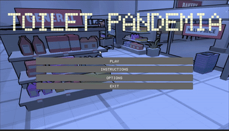
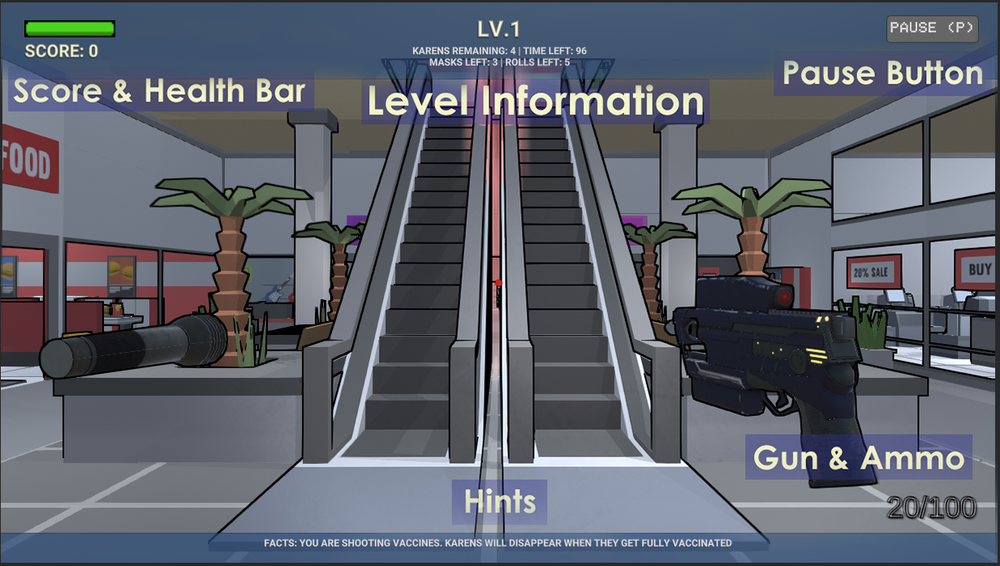

# Toilet Pandemia

## Table of contents
<details>
<summary> Click to expand
</summary>

- [Toilet Pandemia](#toilet-pandemia)
  - [Table of contents](#table-of-contents)
  - [Team Members](#team-members)
  - [Game Explanation and Gameplay](#game-explanation-and-gameplay)
    - [**Game Explanation**](#game-explanation)
    - [**Gameplay**](#gameplay)
      - [**<u>Controls</u>**](#ucontrolsu)
      - [**<u>User Interface</u>**](#uuser-interfaceu)
      - [***Menu***](#menu)
      - [***Game Over***](#game-over)
      - [***Gameplay***](#gameplay-1)
  - [Modelling Objects and Entities](#modelling-objects-and-entities)
    - [Object Modelling](#object-modelling)
      - [Third-Party Assets](#third-party-assets)
      - [Custom-Made Karens](#custom-made-karens)
    - [Object Pooling](#object-pooling)
    - [Karen Control](#karen-control)
      - [**Following Player**](#following-player)
      - [**Close-Range Infection**](#close-range-infection)
      - [**Shooting Fireballs**](#shooting-fireballs)
    - [Level Switching & Vaccine](#level-switching--vaccine)
  - [Graphics and Camera](#graphics-and-camera)
    - [Graphics Pipeline](#graphics-pipeline)
    - [Camera Control](#camera-control)
  - [Shaders and Particles](#shaders-and-particles)
    - [Toon Shader](#toon-shader)
      - [1. Multiple Light Sources:](#1-multiple-light-sources)
      - [2. Ambient Light:](#2-ambient-light)
      - [3. Specular Reflection](#3-specular-reflection)
      - [4. Rim Lighting](#4-rim-lighting)
    - [Outline Shader](#outline-shader)
      - [1. Drawing outlines with depth](#1-drawing-outlines-with-depth)
      - [2. Drawing outlines with normals](#2-drawing-outlines-with-normals)
    - [Half-tone Shader](#half-tone-shader)
      - [1. Properties and values:](#1-properties-and-values)
      - [2. Structs:](#2-structs)
      - [3. Functions:](#3-functions)
    - [Transparency Modification Shaders](#transparency-modification-shaders)
      - [**Foggy Shader**](#foggy-shader)
      - [**Blinking Shader**](#blinking-shader)
    - [Particles](#particles)
      - [Explosion](#explosion)
      - [Additive Blending](#additive-blending)
  - [Evaluation Techniques](#evaluation-techniques)
  - [External Code/APIs](#external-codeapis)
    - [Assets](#assets)
    - [Shader](#shader)
  - [Team Contributions](#team-contributions)

</details>

## Team Members

|       Name        |
| :---------------: |
|   Angus Hudson    |
|    Khoi Nguyen    |
| Luu Hoang Anh Huy |
| Hoang Long Nguyen |

## Game Explanation and Gameplay
### **Game Explanation**

Our game is a first person shooter (FPS), based in a post-apocalyptic world where COVID-19 has ravaged the world's population. You assume the role of an average manager, intent on locating and distributing the vaccine to finally put an end to the pandemic. However this vaccine is held in a nearby shopping center, defended by a horde of Karens who want nothing more than to see the world burn, having succumbed to the frustrations of state-enforced lockdown long ago. 

Your objective, to enter the shopping center, and collect critical supplies for the residents in your community, all the while doing the following:

1. Avoiding incineration at the hands of the Karens' powerful fire attacks
2. Maintaining an appropriate 1.5m social distance, or else risk contracting COVID-19 from the Karens themselves
3. Surviving long enough to discover the super vaccine, and taking it when it appears

Points are accrued for gathering supplies, defeating Karens, and surviving levels. Health packs will also randomly spawn, that will allow the player to recover any lost health. The game takes on a classic arcade 'survival' format, that is, the player plays until he/she finally falls to the Karen hordes, an inevitability since each level rises in difficulty to eventually impossible scenarios.

### **Gameplay**

<p align="center">
  
  <br>A game play of Toilet Pandemia.
</p>

#### **<u>Controls</u>**
|    Button    |      Function      |
| :----------: | :----------------: |
|  `W/A/S/D`   | Character Movement |
|   `Space`    |        Jump        |
| `Left-Mouse` |       Shoot        |
|     `R`      |       Reload       |

#### **<u>User Interface</u>**

#### ***Menu***

In the main menu, user can either adjust volume on Options, read instructions or start the game.
<p align="center">
  
  <br>Using the game's main menu.
</p>

#### ***Game Over***

In game over screen, the high score will also be stored in the system. From here, user can head to main menu or exit the game.
<p align="center">
  
  <br>Going from game over to the main menu.
</p>

#### ***Gameplay***
The gameplay UI, demonstrated by the image below, has the following attributes:


* *Health Bar*: Indicate the player's health. Player will lose when either time is up, or health reaches 0.
* *Scoring System*: Player's score is obtained through collecting goods (Vaccine inclusive) and destroying Karens.
* *Level Information*: As the level goes up, there will be more bonuses and rewards to collect, but also more Karens appear. This UI area will show the necessary information of the current level.
* *Hints*: The hint at the bottom of the screen will constantly change after an amount of time. They will be helpful on the journey to find the Holy Vaccine, such as how to defeat Karens, which position is safe,...

The UI bar has a dark blue color. This choice of color helps minimizing eye fatigue using dark color, as well as distraction using blue tone.

## Modelling Objects and Entities

### Object Modelling

#### Third-Party Assets

To conserve time and focus on gameplay elements, many of the gameplay assets were sourced from third parties online. See [Third-party Assets section](#assets) for further details on external assets used.

#### Custom-Made Karens

The Karens were modelled utilizing a simple custom-made texture superimposed on a default 'Minecraft Steve' object, sourced from [Clara.io](https://clara.io/view/1edd3bc9-ebaf-4bc2-b994-4393ed3ce6d8). The textures were custom-made, and we felt that their utilization solely for the Karen's meant that they sharply contrasted with the rest of the game aesthetic, making them clearly identifiable to any player.

To further distinguish them, Karen's were given a fog shader (see [Fog Shader section](#foggy-shader)) of differing colors, a different size, and potentially given a particle system (see [Particles scetion](#particles)), depending on their strength. The objective of this was to make it clear for the player the relative strengths of the different Karen's presence in the game.

### Object Pooling

In order to maintain efficiency for CPU and avoid continuous calls of `Instanstiate()` and `Destroy()`, an object pool is created in order to keep game objects reusable. The common mechanism goes as follows (based on [pooling tutorial by Mark Placzek](https://www.raywenderlich.com/847-object-pooling-in-unity)):

* A pool of chosen data structure (in this project: `List`) type is created to store objects of a specified number.
```C#
// How a pooled object's information are stored - ObjectPool.cs
[System.Serializable] public class ObjectPoolItem {
    public string name;                 // Object name
    public GameObject objectToPool;     // Prefab of object
    public float amountToPoolEachLevel; // How many to expand each level
    public bool shouldExpand;           // Indicates no limit in capacity
}

public List<ObjectPoolItem> itemsToPool;    // Information storage
public List<GameObject> pooledObjects;      // Object pool data structure
```

<details>
<summary>How a pool is initiated - ObjectPool.cs</summary>


```C#
// How a pool is initiated - ObjectPool.cs

pooledObjects = new List<GameObject>();
foreach (ObjectPoolItem item in itemsToPool) {
    // Initialize the number of items required for the current level
    for (int i = 0; i < Mathf.FloorToInt(item.amountToPoolEachLevel * Player.SharedInstance.level); i++) {
        
        GameObject obj = (GameObject)Instantiate(item.objectToPool);

        // Only hide fireball, the rest appears with new level
        if (item.objectToPool.tag == "Fireball") obj.SetActive(false);
        else obj.SetActive(true);
        
        // Add to storage pool as well
        pooledObjects.Add(obj);
    }
}
```
</details>  


* Every time in need, instead of calling `Instanstiate`, system will choose an inactive item in the pool data structure and activate it.

<details>
<summary>How objects are retrieved on new level rather than Instanstiating - Player.cs</summary>

```C#
// How objects are retrieved on new level rather than Instanstiating - Player.cs 
void SpawnNewLevel() {

    // Look through each pool of item
    foreach (ObjectPoolItem item in ObjectPooler.SharedInstance.itemsToPool) {
        string tag = item.objectToPool.tag;

        // Fireball is only stored for boss karens only, not with levels
        if (tag == "Fireball") continue;

        // Pick items with needed quantity (by level), and set to be active in map
        for (int i = 0; i < Mathf.FloorToInt(item.amountToPoolEachLevel * level); i++) {
            GameObject obj = ObjectPooler.SharedInstance.GetPooledObject(tag);
            if (obj != null) {
                // Allocate a spawn position, and spawn object from there
                obj.GetComponent<randomSpawn>().SetPosition();
                obj.SetActive(true);
            }
        }
    }
}
```
</details>  


* In case of no available object in the pool left, system can either stop if there is a capacity limit, or `Instanstiate` another available object to put to list and later used in the future.
<details>
<summary>How an object is retrieved from the pool - ObjectPool.cs</summary>

```C#
// How an object is retrieved from the pool - ObjectPool.cs

// Returns an object from the pool to be activated
public GameObject GetPooledObject(string tag) {
    // Search in the pool to see if there is any available object left
    for (int i = 0; i < pooledObjects.Count; i++) {
        if (!pooledObjects[i].activeInHierarchy && pooledObjects[i].tag == tag) 
        return pooledObjects[i];
    }

    // If there is none available left, just make a new one
    foreach (ObjectPoolItem item in itemsToPool) {
        if (item.objectToPool.tag == tag) {
            // Note: If there is limited capacity requirement, 
            // then skip this process and return null
            if (item.shouldExpand) {
                GameObject obj = (GameObject)Instantiate(item.objectToPool);
                obj.SetActive(true);
                pooledObjects.Add(obj);
                return obj;
            }
        }
    }
    return null;
}
```
</details>  

* When ending functionality, rather than `Destroy`, system will deactivate the object ( `GameObject.SetActive(false)` ) and put it back to the data structure for later usage.

Currently in the game, the object pool is being used on the following objects that will require the most amount of `Instanstiate` if not using pool:
* Karens
* Bonus items
* Fireball shot by Karens

<p align="center">
  
  <br>Pooled objects are only created once on game start, and only change active status afterwards.
</p>

### Karen Control

As the main enemy, Karens in the game has the objective to chase and infect the player.

#### **Following Player**
When the player is detected to be in sight, depending on the type of Karen, it will either follow, or aim at player
<details>
<summary>Checking if player and karen are close to each other on the same elevation - EnemyFollowing.cs</summary>

```C#
// Check if player and karen are close to each other on the same elevation - EnemyFollowing.cs

float d // Euclidean distance
= Vector3.Distance(followingPlayer.transform.position, transform.position); 

float deltaHeight // Height difference, to avoid detection between different floors
= Mathf.Abs(transform.position.y-followingPlayer.transform.position.y); 

// If in sight...
if (d < distance && deltaHeight < minimumHeightDifference) {
    // Follow or aim at player
    transform.LookAt(followingPlayer.transform.position);
    ...
}
```
</details>  

<p align="center">
  
  <br>A Karen detected and then chased the player.
</p>

#### **Close-Range Infection**
Of course, if the player do not keep social distancing, then health will decrease by time.
<details>
<summary>Social distancing checker - Player.cs</summary>

```C#
// Called every update to see if social distancing is maintained. If not, drain health - Player.cs
void Distance()
{
    // Check each enemy...
    for (int i = 0; i < targets.Length; i++){
            // ... to see how far they are from player
        float distance = Vector3.Distance(targets[i].transform.position, transform.position);
            // If social distancing is broken, then reduce health
        if (distance < distanceMinimum)
        {
            ... // Decrease health
        }
    }

}
```
</details>  

<p align="center">
  
  <br>A Karen that infects the player on close range.
</p>

#### **Shooting Fireballs**

If a Karen is capable of shooting fireballs, it will do so when player is in sight.

As mentioned, at a constant rate, fireballs will be taken from the object pool rather than being instanstiated. It will either explodes on collision with player, or vanish after a while in the air.
<details>
<summary>Fireball implementation - BossBehavior.cs & FireballBehavior.cs</summary>

```C#
// Shoot fireball after a specified period of time - BossBehavior.cs
public void CheckIfTimeToFire()
{
    // When specified shooting time is reached
    if(Time.time > nextFire)
    {
        // Initiate a fireball from pool
        GameObject obj = ObjectPooler.SharedInstance.GetPooledObject("Fireball");
        if (obj != null) {
            obj.transform.position = transform.position;
            obj.transform.rotation = Quaternion.identity;
            obj.SetActive(true);

            // Set fireball to aim at player
            FireBallBehavior fb = obj.GetComponent<FireBallBehavior>();
            fb.Initiate();
        }

        nextFire = Time.time + fireRate; // Set timer for the next fire
    }
} 

// How a fireball can disappear - FireBallBehavior.cs
void Update () {
    // Fireball has limited lifetime
    if (Time.time - startTime > existTime) gameObject.SetActive(false);
}
void OnTriggerEnter(Collider other) {
    // If collides with player...
    if (other.gameObject.CompareTag("Player")) ... ; // Explode and decrease health
}
```
</details>  


<p align="center">
  
  <br>A Karen continuously shooting fireballs at player.
</p>

### Level Switching & Vaccine

In each level, there will be 2 distinguishable stages: in-game and countdown. During the gameplay, the system will constantly check how many Karens are active in the map. 

When there is no Karens left, countdown will start and only in this period, the Holy Vaccince will be available for collect. 

New level is generated when countdown finishes.
<details>
<summary>Implementation between levels - Player.cs</summary>

```C#
// Implementation between levels - Player.cs

// In case of just finished a level...
if (targets.Length==0 && !isCountDown) {
	
	...// Set vaccine to be available

	// Start count down until next level
	startTime = Time.time;
	isCountDown = true;
	timeLeft = levelRelaxTime + startTime - Time.time;
} 

// In case of being in count down: update time left
else if (isCountDown) {
	timeLeft = levelRelaxTime + startTime - Time.time;
	
	// If time's up
	if (timeLeft < 0) {
		
		...// Holy Vaccine disappears
		
		// Generate new level
		level++;
		isCountDown = false;
		SpawnNewLevel();
		targets = GameObject.FindObjectsOfType<EnemyBehavior>();
	}
}
```
</details>  


<p align="center">
  
  <br>Holy Vaccine appears during a 15-second interval between levels.
</p>

****

## Graphics and Camera

### Graphics Pipeline
The game's Pipeline uses Unity render pipeline, with the following standards applied across all shaders:
* Traingle Vertex
* Cull turned on

```C#
  // Common implementation of the vertex shader across game objects
	vertOut vert(vertIn v)
	{
		vertOut o;
		o.vertex = mul(UNITY_MATRIX_MVP, v.vertex);
		o.uv = v.uv;
		return o;
	}
```

### Camera Control
The player's camera will have the following attributes:
* First Person View attached to player, making movement being based on user's interactive control, using `WASD` keyboards. This implementation also helps to avoid camera occlusions that require complicated solutions. 
* Is able to pitch and yaw to look around, using interactive mouse.
* Uses walking navigation across the environment.

## Shaders and Particles

### Toon Shader

<p align="center">
  
  <br> Toon shader effect for collecties.
</p>

This shader is based on https://roystan.net/articles/toon-shader.html

Toon shading (or Cel shading) is a rendering style designed to make 3D surfaces emulate 2D, flat surfaces. By using this shader, the objects will have the cartoon look as the name suggests, and use less computation to reflect light, as it only requires less than 5 different colors rather than continuous color calculations, helping to substantially reduce computation in CPU comparing to most methods such as Phong Reflection.

Toon shader contain 4 main parts. Firstly, it will receive lights from multiple light sources which reflects the real life lights in supermarket. Secondly, it will have ambient light and then specular reflection. Finally, the rim lighting will be applied.

#### 1. Multiple Light Sources:
The shader is implemented based on a basic surface shader with the modified lighting model `LightingStepped(SurfaceOutput s, float3 lightDir, half3 viewDir, float shadowAttenuation)` as below.

To obtain the effect of multiple light sources, first thing to do is calculating how much lighting the surface point received using normalized value. Then comparing this value with the light direction using dot product to obtain the amount of normal points toward the lights.
```C#
#pragma surface surf Stepped fullforwardshadows

float4 LightingStepped(SurfaceOutput s, float3 lightDir, half3 viewDir, float shadowAttenuation) {
float shadow = shadowAttenuation;
//calculate the lighting based on multiple sources of lights
s.Normal = normalize(s.Normal);

//calculat the normal points of surface toward the light
float diff = dot(s.Normal, lightDir);
```
#### 2. Ambient Light:
The shader now has two parts: dark and light side. However, the dark side is too dark so the next step is to make the dark and light side of the shader less distinct using the effect of diffuse environmental light. 

Ambient light represents the light appears everywhere in the scene and doesn’t not need to come from any specific sources. This toon shader will need the ambient light that affects all surfaces equally and is additive to the light sources. Therefore, the ambient light is calculated using the color `_LightColor0.rgb` and the intensity `lightIntensity` of main light sources.

However, the transition from dark and light side is immediate and happens only over one pixel so the `lightIntensity` need to use function `smoothstep` to make the dark side smoothly blend to the light side.
```C#
// Partition the intensity into light and dark, smoothly interpolated
// between the two to avoid a jagged break.
float towardsLightChange = fwidth(diff);
float lightIntensity = smoothstep(0, towardsLightChange, diff);
float3 diffuse = _LightColor0.rgb * lightIntensity * s.Albedo;

float diffussAvg = (diffuse.r + diffuse.g + diffuse.b) / 3;
```
#### 3. Specular Reflection
The toon shader also need to have the distinct reflections of the light source. This calculation takes in two properties: a specular color that define strength the reflection and a glossiness that controls the size of the reflection. 

* The strength of the specular reflection is defined in Blinn-Phong as the dot product between the normal of the surface and the half vector. The half vector is a vector between the viewing direction and the light source calculated by summing those two vectors and normalizing the result.

* The size of the specular reflection using the `pow` function of  `NdotH` and `lightIntensity` to ensure that the reflection is only drawn when the surface is lit. 
```C#
//Calculate the specular reflection
float3 halfVector = normalize(viewDir + lightDir);
float NdotH = dot(s.Normal, halfVector);

// Adjust the size of _Glossiness 
float specularIntensity = pow(NdotH * lightIntensity, _Glossiness * _Glossiness);
float specularIntensitySmooth = smoothstep(0.005, 0.01, specularIntensity);
float3 specular = specularIntensitySmooth * _SpecularColor.rgb * diffussAvg;
```
#### 4. Rim Lighting 
Rim lighting is used to simulate reflected light on the object. It is useful for toon shaders becasuse it helps the object's silhouette stand out among the flat shaded surfaces.

Rim lighting can be calculateed by taking the dot product of the normal and the view direction, and inverting it.
```C#
//Calculate rim lighting 
float rimDot = 1 - dot(viewDir, s.Normal);

//Make sure the rim lighting smootly blend to the outside of object
float rimIntensity = rimDot * pow(dot(lightDir, s.Normal), _RimThreshold);
rimIntensity = smoothstep(_RimAmount - 0.01, _RimAmount + 0.01, rimIntensity);
float3 rim = rimIntensity * _RimColor.rgb * diffussAvg;
```
### Outline Shader

<p align="center">
  
  <br>Items in the store being distinguished with outlines, instead of color reflections.
</p>

This shader is based on https://roystan.net/articles/outline-shader.html

Outline shader is a shader to highlight important objects on sceen which is commonly paired with toon style shading to replace other computation-expensive reflection methods that require continuous calculations. This shader will make use of Unity's post-processing stack.

Post-processing is the process of applying full-screen filters and effects to a camera’s image buffer before it is displayed to screen. It can significantly improve the visuals of the graphic. (https://github.com/Unity-Technologies/PostProcessing/wiki).

To detect the edge of the object for generarating the outline, we explore adjacent pixels and compare their values. If the values are very differents, there will be an edge. In  this shader, depth and normals buffers algorithms will be used for determine the edge and then compare them at the end for maximum edge coverage.

#### 1. Drawing outlines with depth

First step to detect outlines with depth buffers is calculating `halfScaleFloor` and `halfScaleCeil`. These two values will increse when `Scale` increases. By scaling our UVs this way, we can detect the edge width exactly one pixel at a time.
```C#
float halfScaleFloor = floor(_Scale * 0.5);
float halfScaleCeil = ceil(_Scale * 0.5);

// find 4 UV corners and use above variables to ensure we offset exactly one pixel at a time.
float2 bottomLeftUV = i.texcoord - float2(_MainTex_TexelSize.x, _MainTex_TexelSize.y) * halfScaleFloor;
float2 topRightUV = i.texcoord + float2(_MainTex_TexelSize.x, _MainTex_TexelSize.y) * halfScaleCeil;
float2 bottomRightUV = i.texcoord + float2(_MainTex_TexelSize.x * halfScaleCeil, -_MainTex_TexelSize.y * halfScaleFloor);
float2 topLeftUV = i.texcoord + float2(-_MainTex_TexelSize.x * halfScaleFloor, _MainTex_TexelSize.y * halfScaleCeil);
```
Then we can calculate the depth texture using four UV coordiantes

```C#
float depth0 = SAMPLE_DEPTH_TEXTURE(_CameraDepthTexture, sampler_CameraDepthTexture, bottomLeftUV).r;
float depth1 = SAMPLE_DEPTH_TEXTURE(_CameraDepthTexture, sampler_CameraDepthTexture, topRightUV).r;
float depth2 = SAMPLE_DEPTH_TEXTURE(_CameraDepthTexture, sampler_CameraDepthTexture, bottomRightUV).r;
float depth3 = SAMPLE_DEPTH_TEXTURE(_CameraDepthTexture, sampler_CameraDepthTexture, topLeftUV).r;
```
Finally, we can find the edge depth to detect outlines using Robert's Cross.
```C#
float depthFiniteDifference0 = depth1 - depth0;
float depthFiniteDifference1 = depth3 - depth2;
// edgeDepth is calculated using the Roberts cross operator.
// The same operation is applied to the normal below.
// https://en.wikipedia.org/wiki/Roberts_cross
float edgeDepth = sqrt(pow(depthFiniteDifference0, 2) + pow(depthFiniteDifference1, 2)) * 100;
```
At the end of the depth buffers algorithms to detect outlines, we can already found edges of the object but many of them are not discovered because the `edgeDepth` was too small. So we need to use a second algorithm to detect edges which are normal buffers.
#### 2. Drawing outlines with normals

Simply repeat the above process but using normal buffers instead of depth.

The normal texture can be calculated based on the main camera to generate view-space normals.
```C#
float3 normal0 = SAMPLE_TEXTURE2D(_CameraNormalsTexture, sampler_CameraNormalsTexture, bottomLeftUV).rgb;
float3 normal1 = SAMPLE_TEXTURE2D(_CameraNormalsTexture, sampler_CameraNormalsTexture, topRightUV).rgb;
float3 normal2 = SAMPLE_TEXTURE2D(_CameraNormalsTexture, sampler_CameraNormalsTexture, bottomRightUV).rgb;
float3 normal3 = SAMPLE_TEXTURE2D(_CameraNormalsTexture, sampler_CameraNormalsTexture, topLeftUV).rgb;
```
Then we calculate the edge based on normal buffers
```C#
float3 normalFiniteDifference0 = normal1 - normal0;
float3 normalFiniteDifference1 = normal3 - normal2;
// Dot the finite differences with themselves to transform the 
// three-dimensional values to scalars.
float edgeNormal = sqrt(dot(normalFiniteDifference0, normalFiniteDifference0) + dot(normalFiniteDifference1, normalFiniteDifference1));
edgeNormal = edgeNormal > _NormalThreshold ? 1 : 0;
```

Finally, we can combine the results of the depth and normal edge detection operations using the max function and give the color to the edges.
```C#
float edge = max(edgeDepth, edgeNormal);

float4 edgeColor = float4(_Color.rgb, _Color.a * edge);

float4 color = SAMPLE_TEXTURE2D(_MainTex, sampler_MainTex, i.texcoord);

return alphaBlend(edgeColor, color);
```


### Half-tone Shader

<p align="center">
  
  <br>A Karen being flashed. The light intensity is shown through circle density, rather than shades of color.
</p>

Half-tone is the reprographic technique that simulates continuous-tone imagery using dots, varying either in size or in spacing, thus generating a gradient-like effect. Half-tone is commonly found in comic books. Half-tone shading is a common toon shading technique, which unlike normal shading, it only uses full lit or full unlit as colors. 

Also, this shading technique uses a pattern to decide which pixels are lit or not, with the chance of a pixel being lit gets higher the brighter the pixel would be with a normal lighting method. As a result, using half-tone shader for the Karens would increase the performance of the CPU since it only uses one distinct color in shadow rather than continuous colors, therefore it takes fewer calculations to perform.
Implementation is based on [a tutorial on Ronja Tutorials](https://www.ronja-tutorials.com/2019/03/02/halftone-shading.html).

#### 1. Properties and values:
The shader consist of 3 type of properties and values to adjust in the inspector. 

The first one is the basic properties of the object.
```c#
  sampler2D _MainTex;
  fixed4 _Color;
  half3 _Emission;
```
The second property is for the shading.
```c#
  sampler2D _HalftonePattern;
  float4 _HalftonePattern_ST;
```

The last one is the remapping values. We implement these changable values to change how much of the shading is shadowed and how much is illuminated for greater effects on different types of Karens. Since each Karen type has a different size and look, giving the ability to change the remap values easy can help ease the process of fitting the shading to each Karen.
```c#
  float _RemapInputMin;
  float _RemapInputMax;
  float _RemapOutputMin;
  float _RemapOutputMax;
```

#### 2. Structs:
The half-tone shader use 2 structs to hold information.

The first struct is the HalftoneSurface Output. Our half-tone shader impliments screenspace coordinates for the shading texture that is not shown when there is no light pointing at the object. As a result, we have to get our shading texture from the surface function to the lighting function as soon as we created it. For that purpose, the HalftoneSurfaceOutput struct is created to store all the necessary data, which consist of the base color of the shader, the screenspace texture coordinate, the emission of the material, the alpha transparency and the normal.
```c#
    struct HalftoneSurfaceOutput {
		fixed3 Albedo;
		float2 ScreenPos;
		half3 Emission;
		fixed Alpha;
		fixed3 Normal;
	};
```

Lastly, the Input struct which holds the informations that is filled automatically by Unity.
```c#
    struct Input {
		float2 uv_MainTex;
		float4 screenPos;
	};
```
#### 3. Functions:
There are 3 functions used be the shader.

The first function is the map function. The function consists of two parts, first we get the relative position of the input value by first subtracting the input minimum to make the value based on zero and then we divide it by the range of the input values which we can calculate by subtracting the minimum from the maximum. This relative value will be between 0 and 1 if the input value is between the minumum and maximum values, but is also able to represent values outside of that range. With this value we can then do a linear interpolation from the output minimum to the output maximum values and return the result of that.
```c#
    float map(float input, float inMin, float inMax, float outMin,  float outMax) {
		float relativeValue = (input - inMin) / (inMax - inMin);
		return lerp(outMin, outMax, relativeValue);
	}
```

Secondly, we use the function surf as our surface shader function to sets the parameters for our lighting function. To this step, we already have a value that represents how much a given pixel is lit, the next step is to change it from a gradient to a binary one or zero value. To do this we have to compare the value to another value. For this project, we’re getting this other value by sampling a texture via screenspace texture coordinates.
```c#
    void surf(Input i, inout HalftoneSurfaceOutput o) {
		//Set surface colors
		fixed4 col = tex2D(_MainTex, i.uv_MainTex);
		col *= _Color;
        o.Albedo = col.rgb;

		o.Emission = _Emission;

		//Setup screenspace UVs for lighing function
        float aspect = _ScreenParams.x / _ScreenParams.y;
		o.ScreenPos = i.screenPos.xy / i.screenPos.w;
        o.ScreenPos = TRANSFORM_TEX(o.ScreenPos, _HalftonePattern);
		o.ScreenPos.x = o.ScreenPos.x * aspect;
	}
```

Our last function is the LightingHalftone, which is the lighting function called once per light. As we have had both the light intensity and the halftone comparison value we can compare them with the smoothstep function rather than the step function to interpolate the colors over a single pixel since we’re not actually limited by binary colors in our shaders. The first task is to figure out how much the value we compare to changes over a single pixel. Luckily we have the fwidth function which returns an approximation of exactly that value. We divide the value of a halftone by two and then do the smoothstep from the comparison value minus half of the change where the result will be zero to the comparison value plus half of the change where the result will be one. The value we use to step between those values is the light intensity.
```c#
    float4 LightingHalftone(HalftoneSurfaceOutput s, float3 lightDir, float atten) {
		//How much does the normal point towards the light?
		float towardsLight = dot(s.Normal, lightDir);
		//Remap the value from -1 to 1 to between 0 and 1
        towardsLight = towardsLight * 0.5 + 0.5;
		//Combine shadow and light and clamp the result between 0 and 1
		float lightIntensity = saturate(towardsLight * atten).r;

		//Get halftone comparison value
		float halftoneValue = tex2D(_HalftonePattern, s.ScreenPos).r;

		//Make lightness binary between fully lit and fully shadow based on halftone pattern (with a bit of antialiasing between)
        halftoneValue = map(halftoneValue, _RemapInputMin, _RemapInputMax, _RemapOutputMin, _RemapOutputMax);
		float halftoneChange = fwidth(halftoneValue) * 0.5;
		lightIntensity = smoothstep(halftoneValue - halftoneChange, halftoneValue + halftoneChange, lightIntensity);

		//Combine the color
		float4 col;
		//Intensity calculated previously, diffuse color, light falloff and shadowcasting, color of the light
        col.rgb = lightIntensity * s.Albedo * _LightColor0.rgb;

		//In case we want to make the shader transparent in the future - irrelevant right now
		col.a = s.Alpha;

		return col;
	}
```

### Transparency Modification Shaders 
The following Shaders are created based on:
* [A Unity tutorial on transparency](https://learn.unity.com/tutorial/writing-your-first-shader-in-unity)
* [A question thread on modifying transparency](https://answers.unity.com/questions/617420/change-transparency-of-a-shader.html)

#### **Foggy Shader**

Fog Shader uses position and pre-defined mask to modify the alpha channel of texture color, creating a varied opacity that resembles both a foggy and cyclonic effect. 

Even though simple, this shader is used for object types that takes the most number of occurrenes in the game - Karens and collectibles. See GIF images on [Karen Control section](#karen-control) to see the effects being implemented on Karens.
```c#
    float _Distance;
    sampler2D _Mask;    // Pre-made Mask to map opacity to object
    float _Speed;       // Offset speed
    fixed _ScrollDirX;  // Directions will affect the flow direction
    fixed _ScrollDirY;
    fixed4 _Color;      // Customize fog color if desired

    fixed4 frag(v2f i) : SV_Target
    {
        // Modifying UV coordinates to make texture rotate by time
        // For equivalent method in C#, see OffsetByTime.cs
        float2 uv = i.uv + fixed2(_ScrollDirX, _ScrollDirY) * _Speed * _Time.x;
        fixed4 col = tex2D(_MainTex, uv) * _Color * i.vertCol;
        // Modify opacity across positions using Mask to match alpha colors
        col.a *= tex2D(_Mask, i.uv2).r;
        col.a *= 1 - ((i.pos.z / i.pos.w) * _Distance);
        return col;
    }
```

<p align="center">
  
  <br>The effect of a blue storm surrounding collectibles created by Fog Shader.
</p>

#### **Blinking Shader**

By modifying the alpha channel of the texture's color by time, blinking effect is created. This effect is used for the Holy Vaccine's container, which can be seen from the GIF image in [Level Switching & Vaccine section](#level-switching--vaccine).
```C#
float4 frag(vertOut input) : COLOR
    {

      float4 color = tex2D(_MainTex, float2(input.tex.xy));   
      
      if(color.a < _CutOff) discard;    // Limit the transparency if it is set
      else color.a = abs(sin(_Time.y)); // Varying opacity between (0,1) by time
      
      return color;
    }
```

### Particles
In this project, we use a lot of particle systems to create effects for the game.
<p align="center">
  
  <br>Particle effects shown in a boss fight.
</p>

#### Explosion

<p align="center">
  
  <br>A Karen being exploded.
</p>

#### Additive Blending

<p align="center">
  
  <br>A Boss Karen, where its overlaying particles will create a brighter particle.
</p>

Using additive bleding method to blend the background and final particle color together
## Evaluation Techniques

**Description of Process**

As part of the development of this game, two evaluation techniques were utilized to gather feedback from five external participants and improve the game. One querying method, 'cooperative evaluation', and one observational method, 'questionnaire', made up these two techniques.

We felt that these two techniques were very synergistic, since cooperative evaluation involves an ongoing dialogue during gameplay, effectively capturing player thoughts during a playthrough, and a questionnaire is completed after gameplay, after the player has had ample chance to reflect. This meant that we would gather useful insights at all stages of the player experience. Both were also practical given the current climate, since both had zero requirements for face-to-face contact.

**Cooperative Evaluation**: For cooperative evaluation, the test user entered a 1-on-1 Zoom call with a member of the team, and would share their screen. During gameplay, the test user was invited to share any thoughts they had when playing the game, with emphasis on zero judgement for any comments made, which encouraged an open dialogue between the team member and test user. When the user was silent, the user was left to their own device.

**Questionnaire**: For the questionnaire, the test user was given a link to an online questionnaire roughly 10-15 minutes after completion of the game. See below for a link to the questionnaire:

https://www.surveymonkey.com/r/2ZJDMKM

The intent of this questionnaire was to uncover any core gameplay issues that users felt detracted from the quality of the game, and also prompted for any new features the user would like to see.

**Description of Participants**

For cooperative evaluation, a total of five different users were tested. All of these test users fell under a category of 'males aged 18-24 who frequently engage in games of this nature'. Whilst this set of test users is not diverse, we felt that their represented the core target market that such a game would have, and therefore the set of users whose comments and suggestions would be of greatest importance. Also, since these test users are all well-versed in the FPS genre, they possessed superior understanding of what makes an FPS game good compared to others, which allowed them to provide more specific and insightful feedback. 

For the questionnaire, a total of eight different users were tested, all different from those who did the cooperative evaluation. This group of users were more diverse, including two female users, but again all of these users fell under the desired '18-24 year old gamer' category, which represented our core audience. 

**Feedback**

The evaluation process outlined above gave rise to a plethora of feedback, some positive and most negative, that provided us with a clear roadmap for the last couple of days of development to produce a finished, polished product. The core positive was that the game was fundamentally 'fun', during cooperative evaluation, all five users engaged emotionally with the game and reacted in expected ways, for example being afraid of the Karen's, and laughing at the references prevalent throughout. However, there were a variety of criticisms that detracted from this fun, which included:

- A lack of sound cues for different activities, such as collecting loot or firing a gun
- FPS issues on less powerful machines, due to there being too many redundant assets in the game
- A narrow field of view, which gave the players an impression of being 'zoomed in'
- Initial disorientation at the start of the game, due to a poor spawning location
- Extremely high mouse sensitivity, which led to loss of control and confusion, this was the largest issue identified by all five to be game-breaking
- A lack of clarity in game instructions, which meant early on that players were unsure of what to do
- A difficulty of understanding when enemies were being hit and taking damage, due to a lack of a visible enemy health bar

These represented the issues deemed of 'critical' importance, out of three categories we created for feedback which included 'good to have' and 'less important'. Given the restricted timeframe for developing the game, we decided to categorize suggestions by importance, as well as difficulty of implementation. For example, almost all of the suggestions above were given an 'easy' difficulty, meaning that they were very simple fixes. It was decided  to action on anything within the 'critical' category, and anything 'easy or medium' in the 'good to have category', which we felt maximized quality of life within the game whilst keeping scope realistic. 

**Post-evaluation Implementation**

Some 'good to have' features that were implemented to the game based on feedback included:

- Fireballs being shot from Karen's mouths instead of their feet, to better simulate coughing
- A slower rate of gunshot fire, so the user would not have to spam click, an option for holding down left-click to fire, and ammunition mechanics
- A timer during rounds to kill all the Karen's, so the user would feel time pressure during rounds
- Sound effects for gunshots and item collection
- Implementation of health bar for Karens
- Cut down on redundant assets & more clear instruction
- Widen player's field of view
- Make UI more consistent and visible for different window sizes

And some 'less important' features that were left out included:  

- Introducing a 2nd unique weapon, plus a scope mode for each weapon
- A mini-map that shows collectibles and enemy Karens
- Shooting and enemy movement animations

<p align="center">
  
  
  <br>2 versions of Toilet Pandemia. The first version was given out as prototype to gather evaluation feedback,
  <br>and the latter is later made as an improvement to the former by implementing the feedbacks.
</p>

Overall, we found that the 'cooperative evaluation' part of our evaluation process to be of substantially greater value than the questionnaire. The reasoning for this was that 'think aloud' more readily enabled test users to go in-depth with their considerations of the game, since it was a conversational tone where team members could prompt for more depth. What we found with the questionnaire is that there was a lack of detail in responses, even when prompted, which we attributed to the lack of direct interaction with the team and thus there was less incentive to engage with the project. Being said, the questionnaire did produce some useful suggestions for improvement, but critical core gameplay issues such as FPS and mouse sensitivity were mostly ignored.

## External Code/APIs

### Assets
To conserve time and focus on gameplay elements, many of the gameplay assets were sourced from third parties online:

- Gun sourced from the 'Sci-Fi Weapons' free pack at [DevAssets](https://devassets.com/assets/sci-fi-weapons/).
- Flashlight sourced from [Unity Asset Store](https://assetstore.unity.com/publishers/884).
- Toilet paper sourced from [Done3d](http://done3d.com/toilet-paper/)
- N95 mask sourced from [TurboSquid](https://www.turbosquid.com/3d-models/n95-mask-coronavirus-3d-model-1535320).
- The supermarket environment sourced from [Unity Assest Store](https://assetstore.unity.com/publishers/5217).
- 'Minecraft Steve' object, sourced from [Clara.io](https://clara.io/view/1edd3bc9-ebaf-4bc2-b994-4393ed3ce6d8).

To ensure a consistent aesthetic for the game in spite of these different sources of objects, the toon shader (see [Toon Shader section](#toon-shader)) was utilized for all objects.

### Shader

Tutorial sources:
* Transparent modification: https://learn.unity.com/tutorial/writing-your-first-shader-in-unity
* Toon shader: https://roystan.net/articles/toon-shader.html 
* Outline shader: https://roystan.net/articles/outline-shader.html 
* Half-tone shader: https://www.ronja-tutorials.com/2019/03/02/halftone-shading.html

## Team Contributions

|   Team Member    |                              Contribution                              |
| :--------------: | :--------------------------------------------------------------------: |
|   Angus Hudson   |             Gameplay, Graphic & Camera, Evaluation, Report             |
|   Khoi Nguyen    | Gameplay, Object Modelling, Graphics & UI, Transparent Shaders, Report |
|     Huy Luu      |        Gameplay, Graphic & Camera, Shaders & Particles, Report         |
| HoangLong Nguyen |             Object Modelling, Shaders & Particles, Report              |