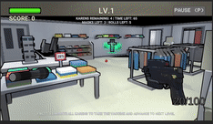
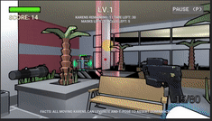

# Toilet Pandemia

**To-Do List**

- [ ] Brief explanation of the game
- [ ] How to use it (especially the user interface aspects)
- [ ] How you modelled objects and entities
- [ ] How you handled the graphics pipeline and camera motion
- [ ] Descriptions of how the shaders work
- [ ] Description of the querying and observational methods used, including: description of the participants (how many, demographics), description of the methodology (which techniques did you use, what did you have participants do, how did you record the data), and feedback gathered.
- [ ] Document the changes made to your game based on the information collected during the evaluation.
- [ ] A statement about any code/APIs you have sourced/used from the internet that is not your own.
- [ ] A description of the contributions made by each member of the group.


## Table of contents
<details>
<summary> Click to expand
</summary>

- [Toilet Pandemia](#toilet-pandemia)
  - [Table of contents](#table-of-contents)
  - [Team Members](#team-members)
  - [Game Explanation and Gameplay](#game-explanation-and-gameplay)
    - [**Game Explanation**](#game-explanation)
    - [**Gameplay**](#gameplay)
      - [**<u>Controls</u>**](#ucontrolsu)
      - [**<u>User Interface</u>**](#uuser-interfaceu)
      - [***Menu***](#menu)
      - [***Game Over***](#game-over)
      - [***Gameplay***](#gameplay-1)
  - [Modelling Objects and Entities](#modelling-objects-and-entities)
    - [Object Modelling](#object-modelling)
    - [Object Pooling](#object-pooling)
    - [Karen Control](#karen-control)
      - [**Following Player**](#following-player)
      - [**Close-Range Infection**](#close-range-infection)
      - [**Shooting Fireballs**](#shooting-fireballs)
    - [Level Switching & Vaccine](#level-switching--vaccine)
  - [Graphics and Camera](#graphics-and-camera)
    - [Graphics Pipeline](#graphics-pipeline)
    - [Camera Control](#camera-control)
  - [Shaders and Particles](#shaders-and-particles)
    - [Toon Shader](#toon-shader)
      - [1. Multiple Light Sources:](#1-multiple-light-sources)
      - [2. Ambient Light:](#2-ambient-light)
      - [3. Specular Reflection](#3-specular-reflection)
      - [4. Rim Lighting](#4-rim-lighting)
    - [Outline Shader](#outline-shader)
    - [Half-tone Shader](#half-tone-shader)
    - [Transparency Modification Shaders](#transparency-modification-shaders)
      - [**Foggy Shader**](#foggy-shader)
      - [**Blinking Shader**](#blinking-shader)
    - [Particles](#particles)
      - [Explosion](#explosion)
      - [Additive Blending](#additive-blending)
  - [Evaluation Techniques](#evaluation-techniques)
  - [External Code/APIs](#external-codeapis)
    - [Assets](#assets)
    - [Shader](#shader)
  - [Team Contributions](#team-contributions)

</details>

## Team Members

|       Name        |
| :---------------: |
|   Angus Hudson    |
|    Khoi Nguyen    |
| Luu Hoang Anh Huy |
| Hoang Long Nguyen |

## Game Explanation and Gameplay
### **Game Explanation**

Our game is a first person shooter (FPS), based in a post-apocalyptic world where COVID-19 has ravaged the world's population. You assume the role of an average manager, intent on locating and distributing the vaccine to finally put an end to the pandemic. However this vaccine is held in a nearby shopping center, defended by a horde of Karens who want nothing more than to see the world burn, having succumbed to the frustrations of state-enforced lockdown long ago. 

Your objective, to enter the shopping center, and collect critical supplies for the residents in your community, all the while doing the following:

1. Avoiding incineration at the hands of the Karens' powerful fire attacks
2. Maintaining an appropriate 1.5m social distance, or else risk contracting COVID-19 from the Karens themselves
3. Surviving long enough to discover the super vaccine, and taking it when it appears

Points are accrued for gathering supplies, defeating Karens, and surviving levels. Health packs will also randomly spawn, that will allow the player to recover any lost health. The game takes on a classic arcade 'survival' format, that is, the player plays until he/she finally falls to the Karen hordes, an inevitability since each level rises in difficulty to eventually impossible scenarios.

### **Gameplay**

#### **<u>Controls</u>**
|    Button    |      Function      |
| :----------: | :----------------: |
|  `W/A/S/D`   | Character Movement |
|   `Space`    |        Jump        |
| `Left-Mouse` |       Shoot        |
|     `R`      |       Reload       |

#### **<u>User Interface</u>**

#### ***Menu***
<p align="center">
  
  <br>Main menu.
</p>

#### ***Game Over***
<p align="center">
  
  <br>Game over.
</p>

#### ***Gameplay***

*Health Bar*

*Scoring System*

*Level Count*

*Hints*

[Insert UI screenshot with captions explaining the different features on-screen]

## Modelling Objects and Entities

### Object Modelling

**Third-Party**

To conserve time and focus on gameplay elements, many of the gameplay assets were sourced from third parties online. See [Third-party Assets scetion](#assets) for further details on external assets used.

**Custom-Made**

<u>Karens</u> 

The Karens were modelled utilizing a simple custom-made texture superimposed on a default 'Minecraft Steve' object, sourced from [Clara.io](https://clara.io/view/1edd3bc9-ebaf-4bc2-b994-4393ed3ce6d8). The textures were custom-made, and we felt that their utilization solely for the Karen's meant that they sharply contrasted with the rest of the game aesthetic, making them clearly identifiable to any player.

To further distinguish them, Karen's were given a fog shader (see [Fog Shader section](#foggy-shader)) of differing colors, a different size, and potentially given a particle system (see [Particles scetion](#particles)), depending on their strength. The objective of this was to make it clear for the player the relative strengths of the different Karen's presence in the game.

### Object Pooling

In order to maintain efficiency for CPU and avoid continuous calls of `Instanstiate()` and `Destroy()`, an object pool is created in order to keep game objects reusable. The common mechanism goes as follows (based on [pooling tutorial by Mark Placzek](https://www.raywenderlich.com/847-object-pooling-in-unity)):

* A pool of chosen data structure (in this project: `List`) type is created to store objects of a specified number.
```C#
// How a pooled object's information are stored - ObjectPool.cs
[System.Serializable] public class ObjectPoolItem {
    public string name;                 // Object name
    public GameObject objectToPool;     // Prefab of object
    public float amountToPoolEachLevel; // How many to expand each level
    public bool shouldExpand;           // Indicates no limit in capacity
}

public List<ObjectPoolItem> itemsToPool;    // Information storage
public List<GameObject> pooledObjects;      // Object pool data structure
```

```C#
// How a pool is initiated - ObjectPool.cs

pooledObjects = new List<GameObject>();
foreach (ObjectPoolItem item in itemsToPool) {
    // Initialize the number of items required for the current level
    for (int i = 0; i < Mathf.FloorToInt(item.amountToPoolEachLevel * Player.SharedInstance.level); i++) {
        
        GameObject obj = (GameObject)Instantiate(item.objectToPool);

        // Only hide fireball, the rest appears with new level
        if (item.objectToPool.tag == "Fireball") obj.SetActive(false);
        else obj.SetActive(true);
        
        // Add to storage pool as well
        pooledObjects.Add(obj);
    }
}
```

* Every time in need, instead of calling `Instanstiate`, system will choose an inactive item in the pool data structure and activate it.
```C#
// How objects are retrieved on new level rather than Instanstiating - Player.cs 
void SpawnNewLevel() {

    // Look through each pool of item
    foreach (ObjectPoolItem item in ObjectPooler.SharedInstance.itemsToPool) {
        string tag = item.objectToPool.tag;

        // Fireball is only stored for boss karens only, not with levels
        if (tag == "Fireball") continue;

        // Pick items with needed quantity (by level), and set to be active in map
        for (int i = 0; i < Mathf.FloorToInt(item.amountToPoolEachLevel * level); i++) {
            GameObject obj = ObjectPooler.SharedInstance.GetPooledObject(tag);
            if (obj != null) {
                // Allocate a spawn position, and spawn object from there
                obj.GetComponent<randomSpawn>().SetPosition();
                obj.SetActive(true);
            }
        }
    }
}
```

* In case of no available object in the pool left, system can either stop if there is a capacity limit, or `Instanstiate` another available object to put to list and later used in the future.
```C#
// How an object is retrieved from the pool - ObjectPool.cs

// Returns an object from the pool to be activated
public GameObject GetPooledObject(string tag) {
    // Search in the pool to see if there is any available object left
    for (int i = 0; i < pooledObjects.Count; i++) {
        if (!pooledObjects[i].activeInHierarchy && pooledObjects[i].tag == tag) 
        return pooledObjects[i];
    }

    // If there is none available left, just make a new one
    foreach (ObjectPoolItem item in itemsToPool) {
        if (item.objectToPool.tag == tag) {
            // Note: If there is limited capacity requirement, 
            // then skip this process and return null
            if (item.shouldExpand) {
                GameObject obj = (GameObject)Instantiate(item.objectToPool);
                obj.SetActive(true);
                pooledObjects.Add(obj);
                return obj;
            }
        }
    }
    return null;
}
```
* When ending functionality, rather than `Destroy`, system will deactivate the object ( `GameObject.SetActive(false)` ) and put it back to the data structure for later usage.

Currently in the game, the object pool is being used on the following objects that will require the most amount of `Instanstiate` if not using pool:
* Karens
* Bonus items
* Fireball shot by Karens

<p align="center">
  
  <br>Pooled objects are only created once on game start, and only change active status afterwards.
</p>

### Karen Control

As the main enemy, Karens in the game has the objective to chase and infect the player.

#### **Following Player**
When the player is detected to be in sight, depending on the type of Karen, it will either follow, or aim at player
```C#
// Check if player and karen are close to each other on the same elevation - EnemyFollowing.cs

float d // Euclidean distance
= Vector3.Distance(followingPlayer.transform.position, transform.position); 

float deltaHeight // Height difference, to avoid detection between different floors
= Mathf.Abs(transform.position.y-followingPlayer.transform.position.y); 

// If in sight...
if (d < distance && deltaHeight < minimumHeightDifference) {
    // Follow or aim at player
    transform.LookAt(followingPlayer.transform.position);
    ...
}
```
<p align="center">
  
  <br>A Karen detected and then chased the player.
</p>

#### **Close-Range Infection**
Of course, if the player do not keep social distancing, then health will decrease by time.
```C#
// Called every update to see if social distancing is maintained. If not, drain health - Player.cs
void Distance()
{
    // Check each enemy...
    for (int i = 0; i < targets.Length; i++){
            // ... to see how far they are from player
        float distance = Vector3.Distance(targets[i].transform.position, transform.position);
            // If social distancing is broken, then reduce health
        if (distance < distanceMinimum)
        {
            ... // Decrease health
        }
    }

}
```
<p align="center">
  
  <br>A Karen that infects the player on close range.
</p>

#### **Shooting Fireballs**

If a Karen is capable of shooting fireballs, it will do so when player is in sight.
```C#
// Shooting fireballs on sight - BossBehavior.cs

// If in sight...
if (d < distance && deltaHeight < 5) {
    CheckIfTimeToFire();    // Shoot fireballs
}
```

As mentioned, at a constant rate, fireballs will be taken from the object pool rather than being instanstiated. It will either explodes on collision with player, or vanish after a while in the air.
```C#
// Shoot fireball after a specified period of time - BossBehavior.cs
public void CheckIfTimeToFire()
{
    // When specified shooting time is reached
    if(Time.time > nextFire)
    {
        // Initiate a fireball from pool
        GameObject obj = ObjectPooler.SharedInstance.GetPooledObject("Fireball");
        if (obj != null) {
            obj.transform.position = transform.position;
            obj.transform.rotation = Quaternion.identity;
            obj.SetActive(true);

            // Set fireball to aim at player
            FireBallBehavior fb = obj.GetComponent<FireBallBehavior>();
            fb.Initiate();
        }

        nextFire = Time.time + fireRate; // Set timer for the next fire
    }
} 

// How a fireball can disappear - FireBallBehavior.cs
void Update () {
    // Fireball has limited lifetime
    if (Time.time - startTime > existTime) gameObject.SetActive(false);
}
void OnTriggerEnter(Collider other) {
    // If collides with player...
    if (other.gameObject.CompareTag("Player")) ... ; // Explode and decrease health
}
```

<p align="center">
  
  <br>A Karen continuously shooting fireballs at player.
</p>

### Level Switching & Vaccine

In each level, there will be 2 distinguishable stages: in-game and countdown. During the gameplay, the system will constantly check how many Karens are active in the map. 

When there is no Karens left, countdown will start and only in this period, the Holy Vaccince will be available for collect. 

New level is generated when countdown finishes.
```C#
// Implementation between levels - Player.cs

// In case of just finished a level...
if (targets.Length==0 && !isCountDown) {
	
	...// Set vaccine to be available

	// Start count down until next level
	startTime = Time.time;
	isCountDown = true;
	timeLeft = levelRelaxTime + startTime - Time.time;
} 

// In case of being in count down: update time left
else if (isCountDown) {
	timeLeft = levelRelaxTime + startTime - Time.time;
	
	// If time's up
	if (timeLeft < 0) {
		
		...// Holy Vaccine disappears
		
		// Generate new level
		level++;
		isCountDown = false;
		SpawnNewLevel();
		targets = GameObject.FindObjectsOfType<EnemyBehavior>();
	}
}
```

<p align="center">
  
  <br>Holy Vaccine appears during a 15-second interval between levels.
</p>

****

## Graphics and Camera

### Graphics Pipeline
The game's Pipeline uses Unity render pipeline, with the following standards applied across all shaders:
* Traingle Vertex
* Cull turned on

```C#
  // Common implementation of the vertex shader across game objects
	vertOut vert(vertIn v)
	{
		vertOut o;
		o.vertex = mul(UNITY_MATRIX_MVP, v.vertex);
		o.uv = v.uv;
		return o;
	}
```

### Camera Control
The player's camera will have the following attributes:
* First Person View attached to player, making movement being based on user's interactive control, using `WASD` keyboards. This implementation also helps to avoid camera occlusions that require complicated solutions. 
* Is able to pitch and yaw to look around, using interactive mouse.
* Uses walking navigation across the environment.

## Shaders and Particles

```
Descriptions of how the shaders work must be clearly detailed in the
report. It should be made clear how the use of a shader provides a
benefit over an equivalent CPU based approach, if applicable.
```

Evaluate on this very carefully guys! They mostly care abt this and evaluation!
* How shader works (and show which variables does what)
* How it is efficient to CPU
### Toon Shader

Toon shading which has another name is Cel shading is a rendering style designed to make 3D surfaces emulate 2D, flat surfaces. By using this shader, the objects will have the cartoon look as the name.

Toon shader contain 4 main parts. Firstly, it will receive lights from multiple light sources which reflects the real life lights in supermarket. Secondly, it will have ambient light and then specular reflection. Finally, the rim lighting will be applied.
https://www.ronja-tutorials.com/2018/10/20/single-step-toon.html

https://roystan.net/articles/toon-shader.html
#### 1. Multiple Light Sources:
The shader is implemented based on a basic surface shader with the modified lighting model `LightingStepped(SurfaceOutput s, float3 lightDir, half3 viewDir, float shadowAttenuation)` as below.

To obtain the effect of multiple light sources, first thing to do is calculating how much lighting the surface point received using normalized value. Then comparing this value with the light direction using dot product to obtain the amount of normal points toward the lights.
```C#
#pragma surface surf Stepped fullforwardshadows

float4 LightingStepped(SurfaceOutput s, float3 lightDir, half3 viewDir, float shadowAttenuation) {
float shadow = shadowAttenuation;
//calculate the lighting based on multiple sources of lights
s.Normal = normalize(s.Normal);

//calculat the normal points of surface toward the light
float diff = dot(s.Normal, lightDir);
```
#### 2. Ambient Light:
The shader now has two parts: dark and light side. However, the dark side is too dark so the next step is to make the dark and light side of the shader less distinct using the effect of diffuse environmental light. 

Ambient light represents the light appears everywhere in the scene and doesn’t not need to come from any specific sources. This toon shader will need the ambient light that affects all surfaces equally and is additive to the light sources. Therefore, the ambient light is calculated using the color `_LightColor0.rgb` and the intensity `lightIntensity` of main light sources.

However, the transition from dark and light side is immediate and happens only over one pixel so the `lightIntensity` need to use function `smoothstep` to make the dark side smoothly blend to the light side.
```C#
// Partition the intensity into light and dark, smoothly interpolated
// between the two to avoid a jagged break.
float towardsLightChange = fwidth(diff);
float lightIntensity = smoothstep(0, towardsLightChange, diff);
float3 diffuse = _LightColor0.rgb * lightIntensity * s.Albedo;

float diffussAvg = (diffuse.r + diffuse.g + diffuse.b) / 3;
```
#### 3. Specular Reflection
The toon shader also need to have the distinct reflections of the light source. This calculation takes in two properties: a specular color that define strength the reflection and a glossiness that controls the size of the reflection. 

* The strength of the specular reflection is defined in Blinn-Phong as the dot product between the normal of the surface and the half vector. The half vector is a vector between the viewing direction and the light source calculated by summing those two vectors and normalizing the result.

* The size of the specular reflection using the `pow` function of  `NdotH` and `lightIntensity` to ensure that the reflection is only drawn when the surface is lit. 
```C#
//Calculate the specular reflection
float3 halfVector = normalize(viewDir + lightDir);
float NdotH = dot(s.Normal, halfVector);

// Adjust the size of _Glossiness 
float specularIntensity = pow(NdotH * lightIntensity, _Glossiness * _Glossiness);
float specularIntensitySmooth = smoothstep(0.005, 0.01, specularIntensity);
float3 specular = specularIntensitySmooth * _SpecularColor.rgb * diffussAvg;
```
#### 4. Rim Lighting 
Rim lighting is the addition of illumination to the edges of an object to simulate reflected light or backlighting. It is especially useful for toon shaders to help the object's silhouette stand out among the flat shaded surfaces.

The "rim" of an object will be defined as surfaces that are facing away from the camera. We will therefore calculate the rim by taking the dot product of the normal and the view direction, and inverting it.
```C#
//Calculate rim lighting 
float rimDot = 1 - dot(viewDir, s.Normal);

//Make sure the rim lighting smootly blend to the outside of object
float rimIntensity = rimDot * pow(dot(lightDir, s.Normal), _RimThreshold);
rimIntensity = smoothstep(_RimAmount - 0.01, _RimAmount + 0.01, rimIntensity);
float3 rim = rimIntensity * _RimColor.rgb * diffussAvg;
```
### Outline Shader

<p align="center">
  
  <br>Items in the store being distinguished with outlines, instead of color reflections.
</p>

https://roystan.net/articles/outline-shader.html

Outline, or edge detection effects are most commonly associated and paired with toon style shading. However, outline shaders have a wide variety of uses, from highlighting important objects on screen to increasing visual clarity in CAD rendering.

This tutorial will describe step-by-step how to write an outline shader in Unity. The shader will be written as a custom effect for Unity's post-processing stack, but the code can also be used in a regular image effect. 

1. Drawing outlines with depth
To generate outlines, we will sample adjacent pixels and compare their values. If the values are very different, we will draw an edge. Some edge detection algorithms work with grayscale images; because we are operating on computer rendered images and not photographs, we have better alternatives in the depth and normals buffers. We will start by using the depth buffer.

We first calculate two values, halfScaleFloor and halfScaleCeil. These two values will alternatively increment by one as _Scale increases. By scaling our UVs this way, we are able to increment our edge width exactly one pixel at a time—achieving a maximum possible granularity—while still keeping the coordinates centred around i.texcoord.

Next, _Scale will need to be added as a configurable property. Properties are created a bit differently with the post-processing stack. We will first define it as float is our shader program, as usual. Add the following code below the float4 _MainTex_TexelSize line

Next, open the PostProcessOutline.cs file. This file contains classes that manage rendering our custom effect and exposing any configurable values to the editor. We will expose _Scale as a parameter, and pass it into our shader.

If you select the OutlinePostProfile asset now, you will see that Scale has been exposed to the inspector. We'll leave it at 1 for now.

We are now ready to sample the depth texture using our four UV coordinates
As previously stated, effects integrated with the post-processing stack use a variety of macros to ensure multi-platform compatibility. Here we use SAMPLE_DEPTH_TEXTURE on the camera's depth texture. We only take the r channel, as depth is a scalar value, in the 0...1 range. Note that depth is non-linear; as distance from the camera increases, smaller depth values represent greater distances.

With our values sampled, we can now compare the depth of pixels across from each other through subtraction. Note that existing code that is modified will be highlighted in yellow. New code is not highlighted.
As the difference can be positive or negative, we take the absolute value of it before returning the result. Since the difference between nearby depth values can be very small (and therefore difficult to see on screen), we multiply the difference by 100 to make it easier to see.

depthFiniteDifference0 is half of the detected edges, while depthFiniteDifference1 is the other half. You can switch the return value between the two to see the difference.
We now have two scalar values representing the intensity of detected outlines in our image; they will now need to be combined into one. There are several trivial ways to do this, from simply adding the two values together, to plugging them into the max function. We will compute the sum of squares of the two values; this is part of an edge detection operator called the Roberts cross.

The Roberts cross involves taking the difference of diagonally adjacent pixels (we have already done this), and computing the sum of squares of the two values. To do this, we will square both our values, add them together, and then square root the result.
While this has eliminated the dark greys, it has created a few issues. The top of one of the foreground cubes is filled in white, instead of just the edges. As well, the cubes in the background have no edges drawn between their silhouettes. We'll fix the problem with the background cubes for now, and will resolve the foreground one later.

Edges are drawn between areas where the edgeDepth is greater than _DepthThreshold, a constant. It was stated earlier that the depth buffer is non-linear, which has implications for our thresholding. Two cubes a meter apart that are near the camera will have a much larger edgeDepth between them than two cubes that are very far from the camera.

To accommodate this, we will modulate _DepthThreshold based on the existing depth of our surfaces.
This has resolved the issue with the background cubes, but also has created more surface artifacts. As well, many edges (such as those along the staircase) were not detected, as the edgeDepth values between steps was too small. To correctly draw outlines on these surfaces, we will make use of the normals buffer.


2. Drawing outlines with normals
We will now repeat the previous process, except this time using the normals buffer instead of depth. At the end, we will combine the results of the two for maximum edge coverage. Add the following to the fragment shader, below the code sampling the depth buffer.

float3 normal0 = SAMPLE_TEXTURE2D(_CameraNormalsTexture, sampler_CameraNormalsTexture, bottomLeftUV).rgb;
float3 normal1 = SAMPLE_TEXTURE2D(_CameraNormalsTexture, sampler_CameraNormalsTexture, topRightUV).rgb;
float3 normal2 = SAMPLE_TEXTURE2D(_CameraNormalsTexture, sampler_CameraNormalsTexture, bottomRightUV).rgb;
float3 normal3 = SAMPLE_TEXTURE2D(_CameraNormalsTexture, sampler_CameraNormalsTexture, topLeftUV).rgb;
Attached to the camera is a script called RenderReplacementShaderToTexture, setup to generate a camera to render the view-space normals of the scene into _CameraNormalsTexture. We will once again take the difference between these samples to detect outlines.


View-space normals of the scene. These are the normals of the objects relative to the camera.
Note that going forward, you will need to run the scene to get the correct results, as the camera that renders out the normals is generated at runtime.

// Add below the code sampling the normals.				
float3 normalFiniteDifference0 = normal1 - normal0;
float3 normalFiniteDifference1 = normal3 - normal2;

float edgeNormal = sqrt(dot(normalFiniteDifference0, normalFiniteDifference0) + dot(normalFiniteDifference1, normalFiniteDifference1));
edgeNormal = edgeNormal > _NormalThreshold ? 1 : 0;

return edgeNormal;

…

// Add as a new variable.
float _NormalThreshold;
The above process is very similar to what we did with depth, with some differences in how we compute the edge. As our normalFiniteDifference values are vectors, and not scalars, we need to transform them from a 3-dimensional value to a single dimensional value before computing the edge intensity. The dot product is ideal for this; not only does it return a scalar, but by performing the dot product for each normalFiniteDifference on itself, we are also squaring the value.

Because we added _NormalThreshold as a new variable, we will need to expose it in PostProcessOutline.cs.

// Add to the PostProcessOutline class.
[Range(0, 1)]
public FloatParameter normalThreshold = new FloatParameter { value = 0.4f };

…

// Add to the Render method in the PostProcessOutlineRenderer class.
sheet.properties.SetFloat("_NormalThreshold", settings.normalThreshold);

Some new edges, notably those along the staircase's steps, are now visible, while some edges that were previously visible no longer are. To resolve this, we will combine the results of the depth and normal edge detection operations using the max function.

3.1 Calculating view direction
The normals we sampled from _CameraNormalsTexture are in view space; since these are what we want to compare against, we will need the camera's view direction to also be in view space. As we are working with a screen space shader, the view direction in clip space can be easily calculated from the vertex position. To convert this to view space, we'll need access to the camera's clip to view, or inverse projection matrix.

This matrix is not available by default to screen space shaders; we will calculate it in our C# script and pass it into our shader from there. Add the following just above the line calling BlitFullscreenTriangle...

Matrix4x4 clipToView = GL.GetGPUProjectionMatrix(context.camera.projectionMatrix, true).inverse;
sheet.properties.SetMatrix("_ClipToView", clipToView);
...and add the code below as variables to our shader.

float4x4 _ClipToView;
The view to clip (called the projection matrix here) is exposed in the Camera class. Note that we take the inverse of the matrix, as we are transforming our direction from clip to view space, not the other way around. Due to platform differences, it is important to plug the projection matrix into the GetGPUProjectionMatrix function. This ensures that the resulting matrix is correctly configured for our shader.

We can now calculate the view direction in view space. This operation will need to be done in the vertex shader. Up until now, we have been using the built-in VertDefault as our vertex shader. The source code for this shader is available in StdLib.hlsl, which we have included in our file. We'll copy this shader over, and then make some modifications.

// Replace VertDefault with our new shader.
#pragma vertex Vert

…

// Add below the alphaBlend function.
struct Varyings
{
	float4 vertex : SV_POSITION;
	float2 texcoord : TEXCOORD0;
	float2 texcoordStereo : TEXCOORD1;
#if STEREO_INSTANCING_ENABLED
	uint stereoTargetEyeIndex : SV_RenderTargetArrayIndex;
#endif
};

Varyings Vert(AttributesDefault v)
{
	Varyings o;
	o.vertex = float4(v.vertex.xy, 0.0, 1.0);
	o.texcoord = TransformTriangleVertexToUV(v.vertex.xy);

#if UNITY_UV_STARTS_AT_TOP
	o.texcoord = o.texcoord * float2(1.0, -1.0) + float2(0.0, 1.0);
#endif

	o.texcoordStereo = TransformStereoScreenSpaceTex(o.texcoord, 1.0);
	
	return o;
}

…

// Update the fragment shader's declaration to take in our new Varyings struct, instead of VaryingsDefault.
float4 Frag(Varyings i) : SV_Target
In addition to copying over the vertex shader, we have also copied the default struct that is passed from the vertex shader, Varyings. This will allow us to pass the view direction to our fragment shader.

The clip space position (which ranges from -1, -1 at the top left of the screen to 1, 1 at the bottom right) can be interpreted as a the camera's view direction to each pixel, in clip space. This position is already calculated and stored in o.vertex. We will multiply this value by our matrix to transform the direction to view space.


Clip space positions of the vertices, as stored in o.vertex in the vertex shader. The x coordinates are stored in the red channel, while the y coordinates are in the green channel.
// Add to the vertex shader, below the line assigning o.vertex.
o.viewSpaceDir = mul(_ClipToView, o.vertex).xyz;

…

// Add to the Varyings struct.
float3 viewSpaceDir : TEXCOORD2;
You can debug this value out by adding the following to the top of our fragment shader.

return float4(i.viewSpaceDir, 1);
Make sure to remove this line of code after you have observed its results, as we will not use it any further.

3.2 Thresholding with view direction
We are going to modulate depthThreshold based on the difference between the camera's viewing normal and the normal of the surface. To achieve this, we will use the dot product. Add the following below the line declaring edgeDepth.

float3 viewNormal = normal0 * 2 - 1;
float NdotV = 1 - dot(viewNormal, -i.viewSpaceDir);

return NdotV;
When the view normal is sampled from _CameraNormalsTexture it is the range 0...1, while i.viewSpaceDir is in the -1...1 range. We transform the view normal so that both normals are in the same range, and then take the dot product between the two.


As the angle between the normal and the camera increases, the result of the dot product gets larger (as we have inverted it). We want depthThreshold to get larger as the angle increases, too. We could just multiply it by NdotV, but we'll manipulate the value a bit beforehand to gain more control. We will construct a variable called normalThreshold, and multiply depthThreshold by it.

Currently, NdotV ranges from -1...1. We are going to first rescale the value to the 0...1 range to make it easier to work with. We will add a lower bound cutoff, since it is unnecessary to modify the threshold of surfaces that are mostly facing the camera.

// Add below the line declaring NdotV.
float normalThreshold01 = saturate((NdotV - _DepthNormalThreshold) / (1 - _DepthNormalThreshold));
The above equation takes all values of NdotV in the range from _DepthNormalThreshold to 1, and rescales them to be 0...1. By having a lower bound in this way, we are able to apply our new threshold only when surfaces are above a certain angle from the camera. This equation is exposed in Unity as Mathf.InverseLerp, where a is _DepthNormalThreshold, b is 1, and value is NdotV.

Before we multiply it into depthThreshold, we want to do one final transformation of the range. We will take it from 0...1 to instead be from 1 to an upper bound we will define as _DepthNormalThresholdScale.

// Add below the line declaring normalThreshold01.
float normalThreshold = normalThreshold01 * _DepthNormalThresholdScale + 1;
With that done, we can multiply in our value and expose our new variables to the inspector.

// Modify the existing line declaring depthThreshold.
float depthThreshold = _DepthThreshold * depth0 * normalThreshold;

…

// Add as new variables.
float _DepthNormalThreshold;
float _DepthNormalThresholdScale;

…

// Remove the debug return call.
return NdotV;
// Add to PostProcessOutlineRenderer.
[Range(0, 1)]
public FloatParameter depthNormalThreshold = new FloatParameter { value = 0.5f };
public FloatParameter depthNormalThresholdScale = new FloatParameter { value = 7 };

…

// Add to PostProcessOutlineRenderer.
sheet.properties.SetFloat("_DepthNormalThreshold", settings.depthNormalThreshold);
sheet.properties.SetFloat("_DepthNormalThresholdScale", settings.depthNormalThresholdScale);
### Half-tone Shader

<p align="center">
  
  <br>A Karen being flashed. The light intensity is shown through circle density, rather than shades of color.
</p>

Half-tone is the reprographic technique that simulates continuous-tone imagery using dots, varying either in size or in spacing, thus generating a gradient-like effect. Half-tone is commonly found in comic books. Half-tone shading is a common toon shading technique, which unlike normal shading, it only uses full lit or full unlit as colors. Also, this shading technique uses a pattern to decide which pixels are lit or not, with the chance of a pixel being lit gets higher the brighter the pixel would be with a normal lighting method. As a result, using half-tone shader for the Karens would increase the performance of the CPU since it only uses one distinct color in shadow rather than continuous colors, therefore it takes fewer calculations to perform.
https://www.ronja-tutorials.com/2019/03/02/halftone-shading.html

#### 1. Properties and values:
The shader consist of 3 type of properties and values to adjust in the inspector. 

The first one is the basic properties of the object
```c#
    sampler2D _MainTex;
	fixed4 _Color;
	half3 _Emission;
```
The second property is for the shading
```c#
    sampler2D _HalftonePattern;
	float4 _HalftonePattern_ST;
```

The last one is the remapping values
```c#
    float _RemapInputMin;
	float _RemapInputMax;
	float _RemapOutputMin;
	float _RemapOutputMax;
```

#### 2. Helper structs:
The half-tone shader use 2 struct to hold information.

The first struct is the HalftoneSurfaceOutput which holds the information that gets transferred from the surface to the lighting function
```c#
    struct HalftoneSurfaceOutput {
		fixed3 Albedo;
		float2 ScreenPos;
		half3 Emission;
		fixed Alpha;
		fixed3 Normal;
	};
```

Lastly, the Input struct holds the informations that is filled automatically bu Unity.
```c#
    struct Input {
		float2 uv_MainTex;
		float4 screenPos;
	};
```
#### 3. Functions:
There are 3 functions used be the shader.

The first function is the map function, which remaps the values from a input to a output range
```c#
    float map(float input, float inMin, float inMax, float outMin,  float outMax) {
		//Inverse lerp with input range
		float relativeValue = (input - inMin) / (inMax - inMin);
		//Lerp with output range
		return lerp(outMin, outMax, relativeValue);
	}
```

The second function is the LightingHalftone, which is the lighting function called once per light
```c#
    float4 LightingHalftone(HalftoneSurfaceOutput s, float3 lightDir, float atten) {
		//How much does the normal point towards the light?
		float towardsLight = dot(s.Normal, lightDir);
		//Remap the value from -1 to 1 to between 0 and 1
        towardsLight = towardsLight * 0.5 + 0.5;
		//Combine shadow and light and clamp the result between 0 and 1
		float lightIntensity = saturate(towardsLight * atten).r;

		//Get halftone comparison value
		float halftoneValue = tex2D(_HalftonePattern, s.ScreenPos).r;

		//Make lightness binary between fully lit and fully shadow based on halftone pattern (with a bit of antialiasing between)
        halftoneValue = map(halftoneValue, _RemapInputMin, _RemapInputMax, _RemapOutputMin, _RemapOutputMax);
		float halftoneChange = fwidth(halftoneValue) * 0.5;
		lightIntensity = smoothstep(halftoneValue - halftoneChange, halftoneValue + halftoneChange, lightIntensity);

		//Combine the color
		float4 col;
		//Intensity calculated previously, diffuse color, light falloff and shadowcasting, color of the light
        col.rgb = lightIntensity * s.Albedo * _LightColor0.rgb;

		//In case we want to make the shader transparent in the future - irrelevant right now
		col.a = s.Alpha;

		return col;
	}
```

Lastly, we use surf(Input, inout) as our surface shader function to sets the parameters our lighting function uses
```c#
    void surf(Input i, inout HalftoneSurfaceOutput o) {
		//Set surface colors
		fixed4 col = tex2D(_MainTex, i.uv_MainTex);
		col *= _Color;
        o.Albedo = col.rgb;

		o.Emission = _Emission;

		//Setup screenspace UVs for lighing function
        float aspect = _ScreenParams.x / _ScreenParams.y;
		o.ScreenPos = i.screenPos.xy / i.screenPos.w;
        o.ScreenPos = TRANSFORM_TEX(o.ScreenPos, _HalftonePattern);
		o.ScreenPos.x = o.ScreenPos.x * aspect;
	}
```

### Transparency Modification Shaders 
The following Shaders are created based on:
* [A Unity tutorial on transparency](https://learn.unity.com/tutorial/writing-your-first-shader-in-unity)
* [A question thread on modifying transparency](https://answers.unity.com/questions/617420/change-transparency-of-a-shader.html)

#### **Foggy Shader**

Fog Shader uses position and pre-defined mask to modify the alpha channel of texture color, creating a varied opacity that resembles both a foggy and cyclonic effect. 

Even though simple, this shader is used for object types that takes the most number of occurrenes in the game - Karens and collectibles. See GIF images on [Karen Control section](#karen-control) to see the effects being implemented on Karens.
```c#
    float _Distance;
    sampler2D _Mask;    // Pre-made Mask to map opacity to object
    float _Speed;       // Offset speed
    fixed _ScrollDirX;  // Directions will affect the flow direction
    fixed _ScrollDirY;
    fixed4 _Color;      // Customize fog color if desired

    fixed4 frag(v2f i) : SV_Target
    {
        // Modifying UV coordinates to make texture rotate by time
        // For equivalent method in C#, see OffsetByTime.cs
        float2 uv = i.uv + fixed2(_ScrollDirX, _ScrollDirY) * _Speed * _Time.x;
        fixed4 col = tex2D(_MainTex, uv) * _Color * i.vertCol;
        // Modify opacity across positions using Mask to match alpha colors
        col.a *= tex2D(_Mask, i.uv2).r;
        col.a *= 1 - ((i.pos.z / i.pos.w) * _Distance);
        return col;
    }
```

<p align="center">
  
  <br>The effect of a blue storm surrounding collectibles created by Fog Shader.
</p>

#### **Blinking Shader**

By modifying the alpha channel of the texture's color by time, blinking effect is created. This effect is used for the Holy Vaccine's container, which can be seen from the GIF image in [Level Switching & Vaccine section](#level-switching--vaccine).
```C#
float4 frag(vertOut input) : COLOR
    {

      float4 color = tex2D(_MainTex, float2(input.tex.xy));   
      
      if(color.a < _CutOff) discard;    // Limit the transparency if it is set
      else color.a = abs(sin(_Time.y)); // Varying opacity between (0,1) by time
      
      return color;
    }
```

### Particles

<p align="center">
  
  <br>Particle effects shown in a boss fight.
</p>

#### Explosion

<p align="center">
  
  <br>A Karen being exploded.
</p>

#### Additive Blending

<p align="center">
  
  <br>A Boss Karen, where its overlaying particles will create a brighter particle.
</p>

## Evaluation Techniques

**Description of Process**

As part of the development of this game, two evaluation techniques were utilized to gather feedback from five external participants and improve the game. One querying method, 'cooperative evaluation', and one observational method, 'questionnaire', made up these two techniques.

We felt that these two techniques were very synergistic, since cooperative evaluation involves an ongoing dialogue during gameplay, effectively capturing player thoughts during a playthrough, and a questionnaire is completed after gameplay, after the player has had ample chance to reflect. This meant that we would gather useful insights at all stages of the player experience. Both were also practical given the current climate, since both had zero requirements for face-to-face contact.

For cooperative evaluation, the test user entered a 1-on-1 Zoom call with a member of the team, and would share their screen. During gameplay, the test user was invited to share any thoughts they had when playing the game, with emphasis on zero judgement for any comments made, which encouraged an open dialogue between the team member and test user. When the user was silent, the user was left to their own device.

For the questionnaire, the test user was given a link to an online questionnaire roughly 10-15 minutes after completion of the game. See below for a link to the questionnaire:

https://www.surveymonkey.com/r/2ZJDMKM

The intent of this questionnaire was to uncover any core gameplay issues that users felt detracted from the quality of the game, and also prompted for any new features the user would like to see.

**Description of Participants**

For cooperative evaluation, a total of five different users were tested. All of these test users fell under a category of 'males aged 18-24 who frequently engage in games of this nature'. Whilst this set of test users is not diverse, we felt that their represented the core target market that such a game would have, and therefore the set of users whose comments and suggestions would be of greatest importance. Also, since these test users are all well-versed in the FPS genre, they possessed superior understanding of what makes an FPS game good compared to others, which allowed them to provide more specific and insightful feedback. 

For the questionnaire, a total of eight different users were tested, all different from those who did the cooperative evaluation. This group of users were more diverse, including two female users, but again all of these users fell under the desired '18-24 year old gamer' category, which represented our core audience. 

**Feedback**

The evaluation process outlined above gave rise to a plethora of feedback, some positive and most negative, that provided us with a clear roadmap for the last couple of days of development to produce a finished, polished product. The core positive was that the game was fundamentally 'fun', during cooperative evaluation, all five users engaged emotionally with the game and reacted in expected ways, for example being afraid of the Karen's, and laughing at the references prevalent throughout. However, there were a variety of criticisms that detracted from this fun, which included:

- A lack of sound cues for different activities, such as collecting loot or firing a gun
- FPS issues on less powerful machines, due to there being too many redundant assets in the game
- A narrow field of view, which gave the players an impression of being 'zoomed in'
- Initial disorientation at the start of the game, due to a poor spawning location
- Extremely high mouse sensitivity, which led to loss of control and confusion, this was the largest issue identified by all five to be game-breaking
- A lack of clarity in game instructions, which meant early on that players were unsure of what to do
- A difficulty of understanding when enemies were being hit and taking damage, due to a lack of a visible enemy health bar

These represented the issues deemed of 'critical' importance, out of three categories we created for feedback which included 'good to have' and 'less important'. Given the restricted timeframe for developing the game, we decided to categorize suggestions by importance, as well as difficulty of implementation. For example, almost all of the suggestions above were given an 'easy' difficulty, meaning that they were very simple fixes. It was decided  to action on anything within the 'critical' category, and anything 'easy or medium' in the 'good to have category', which we felt maximized quality of life within the game whilst keeping scope realistic. 

Some 'good to have' features that were implemented based on feedback included:

- Fireballs being shot from Karen's mouths instead of their feet, to better simulate coughing
- A slower rate of gunshot fire, so the user wouldn't have to spam click, an option for holding down left-click to fire, and ammunition mechanics
- A timer during rounds to kill all the Karen's, so the user would feel time pressure during rounds

And some 'less important' features that were left out included:  

- Introducing a 2nd unique weapon, plus a scope mode for each weapon
- A mini-map that shows collectibles and enemy Karens
- Shooting and enemy movement animations

Overall, we found that the 'cooperative evaluation' part of our evaluation process to be of substantially greater value than the questionnaire. The reasoning for this was that 'think aloud' more readily enabled test users to go in-depth with their considerations of the game, since it was a conversational tone where team members could prompt for more depth. What we found with the questionnaire is that there was a lack of detail in responses, even when prompted, which we attributed to the lack of direct interaction with the team and thus there was less incentive to engage with the project. Being said, the questionnaire did produce some useful suggestions for improvement, but critical core gameplay issues such as FPS and mouse sensitivity were mostly ignored.

## External Code/APIs

* Long's Supermarket assets
* Minecraft asset
* C# code for shader
* 
### Assets
To conserve time and focus on gameplay elements, many of the gameplay assets were sourced from third parties online:

- Gun sourced from the 'Sci-Fi Weapons' free pack at [DevAssets](https://devassets.com/assets/sci-fi-weapons/).
- Flashlight sourced from [Unity Asset Store](https://assetstore.unity.com/publishers/884).
- Toilet paper sourced from [Done3d](http://done3d.com/toilet-paper/)
- N95 mask sourced from [TurboSquid](https://www.turbosquid.com/3d-models/n95-mask-coronavirus-3d-model-1535320).
- The supermarket environment sourced from [Unity Assest Store](https://assetstore.unity.com/publishers/5217).
- 'Minecraft Steve' object, sourced from [Clara.io](https://clara.io/view/1edd3bc9-ebaf-4bc2-b994-4393ed3ce6d8).

To ensure a consistent aesthetic for the game in spite of these different sources of objects, the toon shader (see [Toon Shader section](#toon-shader)) was utilized for all objects.

### Shader

## Team Contributions


